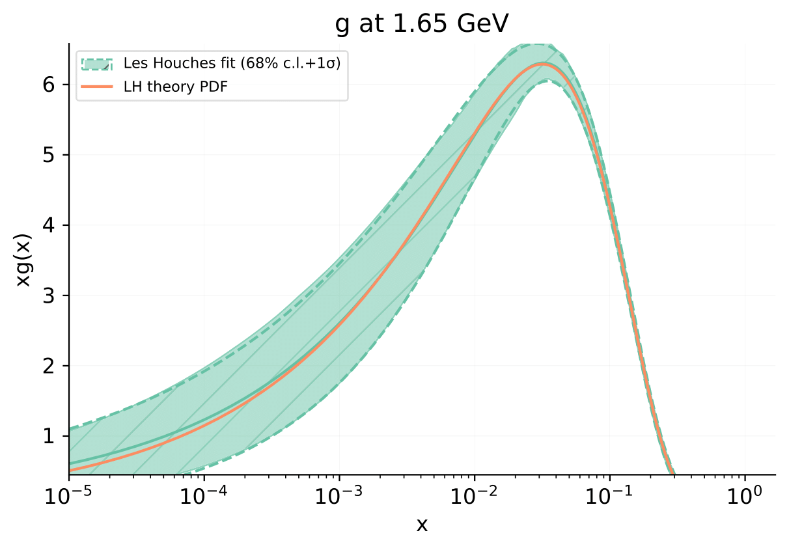

.. _first_fit:

======================
Your First Colibri Fit
======================

In this section, we will guide you through the steps to run a fit with a
PDF model that is already implemented and readily available within Colibri.

For this exercise, we will be running a Level 0 closure test with the Les
Houches parametrisation model, which was implemented in
:ref:`this tutorial <in_les_houches>`.

Make sure you have :ref:`installed the code <installation>` first!

.. _enable-executable:

Step 1: enable the executable
-----------------------------

To run this fit, you will need to be in the right directory:

.. code-block:: bash

    cd colibri/colibri/examples/les_houches_examples/

You will see that, in this directory, there is a ``pyproject.py`` script.
This is the script that will allow you to enable the executable for this
example, by running the following command in your ``colibri-dev`` conda
environment:

.. code-block:: bash
    
    pip install -e .

You now have access to an executable called ``les_houches_exe``, that you
will use to run Les Houches fits. 

Step 2: running the closure test
--------------------------------

In the ``colibri/examples/les_houches_example/runcards`` directory you will find
an example runcard called ``lh_fit_closure_test.yaml``. You can find a detailed
discussion on this runcard on the
:ref:`tutorial on how to run closure tests <lh-closure-test>`. For now, you can
simply run this runcard with the following command:

.. code-block::

    les_houches_exe lh_fit_closure_test.yaml

This step will download the PDF grid ``LH_PARAM_20250519``. 

If you don't have it already, it will also download the theory ``40000000``.

After you run the fit the first time, any subsequent fits should be faster.

A directory called ``lh_fit_closure_test``, containing the output of the fit, 
should have been created. You can read more about the fit folders 
:ref:`here <bayes_fit_folders>`.

Step 3: Evolving the fit
------------------------

If you don't already have it, you will need to download the EKO corresponding to 
the theory used in this tutorial :cite:`Candido:2022tld,Candido2022EKO`:

.. code-block:: bash
    
    vp-get EKO 40000000

You can then evolve the fit by running the following command from the 
``les_houches_example`` directory:

.. code-block:: bash

    evolve_fit lh_fit_closure_test

You can read more on fit evolution in :ref:`this section <evolution_script>`.

Step 4: Generating a `validphys` report
---------------------------------------

Finally, you can run:

.. code-block:: bash

    validphys plot_pdf_fits.yaml

to generate a `validphys` report :cite:`zahari_kassabov_2019_2571601`.

The result
----------

As an example, we show the result of the fit for the gluon PDF. 

The orange line, labelled *LH theory PDF*, shows the gluon PDF used to generate
the pseudo-data, i.e. the underlying law we are trying to recover. As mentioned
above, this was computed using the best-fit values for each parameter, as
presented in Ref. :cite:alp:`Alekhin:2005xgg`. The green curve/section, labelled 
*Les Houches fit 68% c.i. + 1*:math:`\sigma`, shows the result of the closure test
fit with error band.