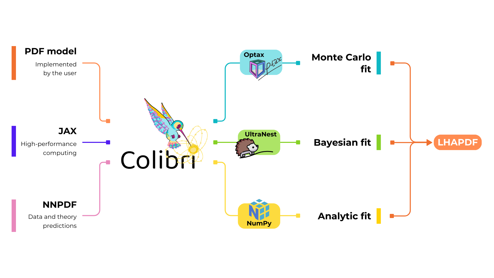

.. _workflow:

Colibri's Workflow
==================

The following diagram presents the workflow of the Colibri code.

   Colibri takes as input **(i)** a PDF model, which may be any arbitrary parametrisation implemented by the user, **(ii)** JAX, which provides high-performance array operations and native GPU support for fast computations, and **(iii)** data and theory predictions, which it inherits from the NNPDF framework. It then performs a fit using a given inference method, which is specified by the user. At the time of release, the options are a Monte Carlo, bayesian or analytic fit. In each case, the result follows the LHAPDF format.
