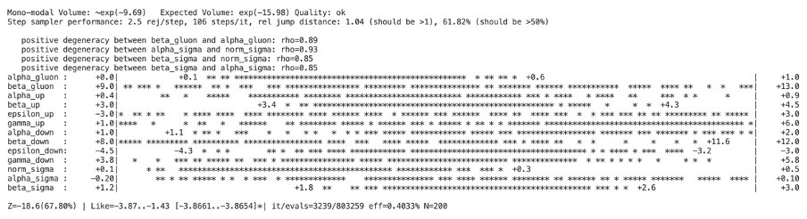
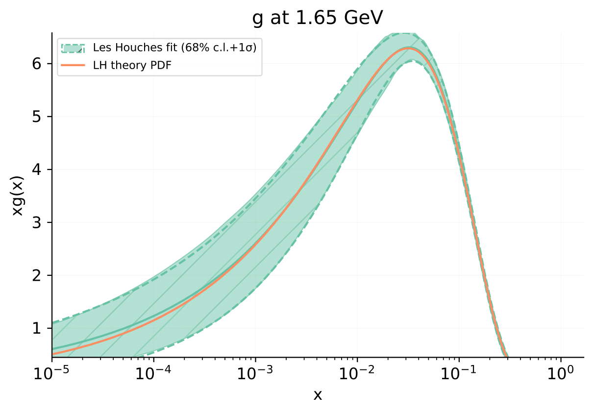

.. _lh-closure-test:

============
Closure Test
============

.. _enable-executable:

Step 1: enable the executable
-----------------------------

The first step is to enable the executable for this tutorial. 

In your ``colibri-dev`` conda environment, go to the ``les_houches_example`` directory, 
found in:

.. code-block:: bash
    
    cd colibri/examples/les_houches_example 

Then run:

.. code-block:: bash
    
    pip install -e .

This will enable an executable called ``les_houches_exe``. 

Step 2: runcard
---------------

In the ``colibri/examples/les_houches_example/runcards`` directory you will find
an example runcard called ``lh_fit_closure_test.yaml``, which looks like this:

.. literalinclude:: ../../../../../examples/les_houches_example/runcards/lh_fit_closure_test.yaml
    :language: python

TODO: add some discussion on the runcard

Step 3: producing the fit
-------------------------

To produce the fit, run the following command from the ``colibri/les_houches_example`` 
directory:

.. code-block:: bash

    les_houches_exe runcards/lh_fit_closure_test.yaml

This step will download the PDF grid ``LH_PARAM_20250429``, which has been produced
by computing the relevant PDFs for the Les Houches model (see :ref:`lh_theory`) with
the best-fit values for the parameters, taken from Ref. :cite:`Alekhin:2005xgg`. 

If you don't have it already, it will also download the theory 
``40000000``.

After you run the fit the first time, any subsequent times should take less than 3 
minutes.

A directory called ``lh_fit_closure_test``, containing the output of the fit, 
should have been created.

Understanding the terminal output
^^^^^^^^^^^^^^^^^^^^^^^^^^^^^^^^^

TODO: add explanation of what the output is.

3.1 Evolving the fit
^^^^^^^^^^^^^^^^^^^^

If you don't already have it, you will need to download the EKO corresponding to the 
theory used in this tutorial;

.. code-block:: bash
    
    vp-get eko 40000000

TODO: add link to EKO NNPDF documentation

You can evolve the fit by running the following command from the ``les_houches_example``
directory:

.. code-block:: bash

    evolve_fit lh_fit_closure_test

3.2 Generating a ``validphys`` report
^^^^^^^^^^^^^^^^^^^^^^^^^^^^^^^^^^^^^

Finally, you can run:

.. code-block:: bash

    validphys plot_pdf_fits.yaml

to generate a validphys report.

The result
----------

As an example, we show the result of the fit for the gluon PDF. 

The orange line, 
labelled *LH theory PDF*, shows the gluon PDF computed from best-fit values for
all parameters. The green curve/section, labelled *Les Houches fit 68% c.i. + 1*:math:`\sigma`, 
shows the result of the fit with error band.