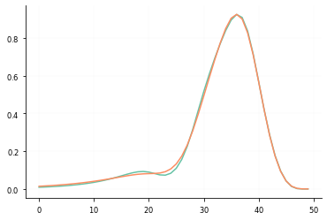
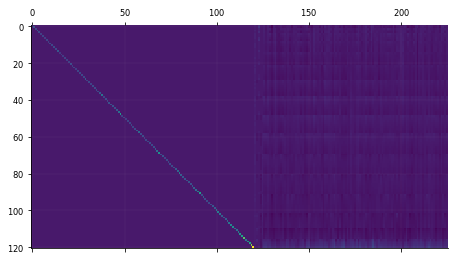
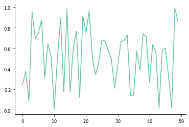
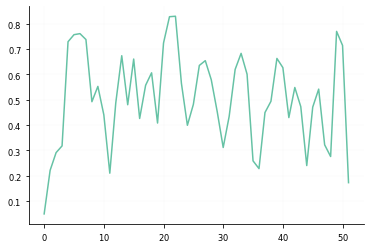

```python

```


```python
import itertools


import numpy as np

#import jax.numpy as jnp
#import jax

#from jax.example_libraries import optimizers

from validphys.api import API
from validphys.fkparser import load_fktable
from validphys.commondataparser import load_commondata
```

    /Users/manuelmorales/miniconda3/envs/simunet-dev/lib/python3.9/site-packages/scipy/__init__.py:146: UserWarning: A NumPy version >=1.16.5 and <1.23.0 is required for this version of SciPy (detected version 1.23.3
      warnings.warn(f"A NumPy version >={np_minversion} and <{np_maxversion}"


```python
inp = {
    "fit": "NNPDF40_nnlo_as_01180_1000",
    "dataset_inputs": {"from_": "fit"},
    "use_cuts": "internal",
    "theoryid": 200
}
```


```python
dir(data)
```


    ['_UserList__cast',
     '__abstractmethods__',
     '__add__',
     '__class__',
     '__class_getitem__',
     '__contains__',
     '__copy__',
     '__delattr__',
     '__delitem__',
     '__dict__',
     '__dir__',
     '__doc__',
     '__eq__',
     '__format__',
     '__ge__',
     '__getattribute__',
     '__getitem__',
     '__gt__',
     '__hash__',
     '__iadd__',
     '__imul__',
     '__init__',
     '__init_subclass__',
     '__iter__',
     '__le__',
     '__len__',
     '__lt__',
     '__module__',
     '__mul__',
     '__ne__',
     '__new__',
     '__radd__',
     '__reduce__',
     '__reduce_ex__',
     '__repr__',
     '__reversed__',
     '__rmul__',
     '__setattr__',
     '__setitem__',
     '__sizeof__',
     '__slots__',
     '__str__',
     '__subclasshook__',
     '__weakref__',
     '_abc_impl',
     'append',
     'argnames',
     'as_markdown',
     'as_namespace',
     'clear',
     'comp_tuple',
     'copy',
     'count',
     'data',
     'datasets',
     'dsinputs',
     'extend',
     'fixed_observables',
     'foinputs',
     'index',
     'insert',
     'iterfixed',
     'load',
     'name',
     'nsitem',
     'nskey',
     'pop',
     'remove',
     'reverse',
     'sort',
     'thspec',
     'to_unweighted']


```python
xx = []

excluded = set()

for ds in data.datasets:
    for fk in ds.fkspecs:
        xgrid = load_fktable(fk).xgrid
        
        if xgrid.shape != (50,):
            print("Excluding", ds)
            excluded.add(ds)
            continue
        else:
            xx.append(xgrid)
```

    Excluding DYE886R_dw_ite
    Excluding DYE886R_dw_ite
    Excluding DYE886P
    Excluding DYE605_dw_ite
    Excluding DYE906R_dw_ite
    Excluding DYE906R_dw_ite
    Excluding DYE906R_dw_ite
    Excluding DYE906R_dw_ite
    Excluding DYE906R_dw_ite
    Excluding DYE906R_dw_ite
    Excluding DYE906R_dw_ite
    Excluding DYE906R_dw_ite
    Excluding DYE906R_dw_ite
    Excluding DYE906R_dw_ite
    Excluding DYE906R_dw_ite
    Excluding DYE906R_dw_ite
    Excluding DYE906R_dw_ite
    Excluding DYE906R_dw_ite
    Excluding DYE906R_dw_ite
    Excluding DYE906R_dw_ite
    Excluding DYE906R_dw_ite
    Excluding DYE906R_dw_ite
    Excluding DYE906R_dw_ite
    Excluding DYE906R_dw_ite
    Excluding CDFZRAP_NEW
    Excluding D0ZRAP_40
    Excluding D0ZRAP_40
    Excluding D0WMASY
    Excluding D0WMASY
    Excluding ATLASWZRAP36PB
    Excluding ATLASZHIGHMASS49FB
    Excluding ATLASLOMASSDY11EXT
    Excluding ATLASWZRAP11CC
    Excluding ATLAS_WZ_TOT_13TEV
    Excluding ATLAS_WP_JET_8TEV_PT
    Excluding ATLAS_WM_JET_8TEV_PT
    Excluding ATLASZPT8TEVMDIST
    Excluding ATLASZPT8TEVYDIST
    Excluding ATLASTTBARTOT7TEV
    Excluding ATLASTTBARTOT8TEV
    Excluding ATLAS_TTBARTOT_13TEV_FULLLUMI
    Excluding ATLAS_TTB_DIFF_8TEV_LJ_TRAPNORM
    Excluding ATLAS_TTB_DIFF_8TEV_LJ_TRAPNORM
    Excluding ATLAS_TTB_DIFF_8TEV_LJ_TTRAPNORM
    Excluding ATLAS_TTB_DIFF_8TEV_LJ_TTRAPNORM
    Excluding ATLAS_TOPDIFF_DILEPT_8TEV_TTRAPNORM
    Excluding ATLAS_TOPDIFF_DILEPT_8TEV_TTRAPNORM
    Excluding ATLAS_1JET_8TEV_R06_DEC
    Excluding ATLASPHT15_SF
    Excluding ATLAS_SINGLETOP_TCH_R_7TEV
    Excluding ATLAS_SINGLETOP_TCH_R_7TEV
    Excluding ATLAS_SINGLETOP_TCH_R_13TEV
    Excluding ATLAS_SINGLETOP_TCH_R_13TEV
    Excluding ATLAS_SINGLETOP_TCH_DIFF_7TEV_T_RAP_NORM
    Excluding ATLAS_SINGLETOP_TCH_DIFF_7TEV_T_RAP_NORM
    Excluding ATLAS_SINGLETOP_TCH_DIFF_7TEV_TBAR_RAP_NORM
    Excluding ATLAS_SINGLETOP_TCH_DIFF_7TEV_TBAR_RAP_NORM
    Excluding ATLAS_SINGLETOP_TCH_DIFF_8TEV_T_RAP_NORM
    Excluding ATLAS_SINGLETOP_TCH_DIFF_8TEV_T_RAP_NORM
    Excluding ATLAS_SINGLETOP_TCH_DIFF_8TEV_TBAR_RAP_NORM
    Excluding ATLAS_SINGLETOP_TCH_DIFF_8TEV_TBAR_RAP_NORM
    Excluding CMSWEASY840PB
    Excluding CMSWEASY840PB
    Excluding CMSWMASY47FB
    Excluding CMSWMASY47FB
    Excluding CMSWMU8TEV
    Excluding CMSZDIFF12
    Excluding CMS_1JET_8TEV
    Excluding CMSTTBARTOT7TEV
    Excluding CMSTTBARTOT8TEV
    Excluding CMSTTBARTOT13TEV
    Excluding CMSTOPDIFF8TEVTTRAPNORM
    Excluding CMSTOPDIFF8TEVTTRAPNORM
    Excluding CMSTTBARTOT5TEV


    ---------------------------------------------------------------------------

    KeyboardInterrupt                         Traceback (most recent call last)

    Cell In [7], line 7
          5 for ds in data.datasets:
          6     for fk in ds.fkspecs:
    ----> 7         xgrid = load_fktable(fk).xgrid
          9         if xgrid.shape != (50,):
         10             print("Excluding", ds)


    File ~/simunetgit/SIMUnet/validphys2/src/validphys/fkparser.py:57, in load_fktable(spec)
         54 """Load the data corresponding to a FKSpec object. The cfactors
         55 will be applied to the grid."""
         56 with open_fkpath(spec.fkpath) as handle:
    ---> 57     tabledata = parse_fktable(handle)
         58 if not spec.cfactors:
         59     return tabledata


    File ~/simunetgit/SIMUnet/validphys2/src/validphys/fkparser.py:308, in parse_fktable(f)
        306 _check_required_sections(res, lineno)
        307 Q0 = res['TheoryInfo']['Q0']
    --> 308 sigma = _build_sigma(f, res)
        309 hadronic = res['GridInfo'].hadronic
        310 ndata = res['GridInfo'].ndata


    File ~/simunetgit/SIMUnet/validphys2/src/validphys/fkparser.py:219, in _build_sigma(f, res)
        216 gi = res["GridInfo"]
        217 fm = res["FlavourMap"]
        218 table = (
    --> 219     _parse_hadronic_fast_kernel(f) if gi.hadronic else _parse_dis_fast_kernel(f)
        220 )
        221 # Filter out empty flavour indices
        222 table = table.loc[:, fm.ravel()]


    File ~/simunetgit/SIMUnet/validphys2/src/validphys/fkparser.py:175, in _parse_hadronic_fast_kernel(f)
        170 """Parse the FastKernel secrion of an hadronic FKTable into a DataFrame.
        171 ``f`` should be a stream containing only the section"""
        172 # Note that we need the slower whitespace here because it turns out
        173 # that there are fktables where space and tab are used as separators
        174 # within the same table.
    --> 175 df = pd.read_csv(f, sep=r'\s+', header=None, index_col=(0,1,2))
        176 df.columns = list(range(14*14))
        177 df.index.names = ['data', 'x1', 'x2']


    File ~/miniconda3/envs/simunet-dev/lib/python3.9/site-packages/pandas/util/_decorators.py:311, in deprecate_nonkeyword_arguments.<locals>.decorate.<locals>.wrapper(*args, **kwargs)
        305 if len(args) > num_allow_args:
        306     warnings.warn(
        307         msg.format(arguments=arguments),
        308         FutureWarning,
        309         stacklevel=stacklevel,
        310     )
    --> 311 return func(*args, **kwargs)


    File ~/miniconda3/envs/simunet-dev/lib/python3.9/site-packages/pandas/io/parsers/readers.py:678, in read_csv(filepath_or_buffer, sep, delimiter, header, names, index_col, usecols, squeeze, prefix, mangle_dupe_cols, dtype, engine, converters, true_values, false_values, skipinitialspace, skiprows, skipfooter, nrows, na_values, keep_default_na, na_filter, verbose, skip_blank_lines, parse_dates, infer_datetime_format, keep_date_col, date_parser, dayfirst, cache_dates, iterator, chunksize, compression, thousands, decimal, lineterminator, quotechar, quoting, doublequote, escapechar, comment, encoding, encoding_errors, dialect, error_bad_lines, warn_bad_lines, on_bad_lines, delim_whitespace, low_memory, memory_map, float_precision, storage_options)
        663 kwds_defaults = _refine_defaults_read(
        664     dialect,
        665     delimiter,
       (...)
        674     defaults={"delimiter": ","},
        675 )
        676 kwds.update(kwds_defaults)
    --> 678 return _read(filepath_or_buffer, kwds)


    File ~/miniconda3/envs/simunet-dev/lib/python3.9/site-packages/pandas/io/parsers/readers.py:581, in _read(filepath_or_buffer, kwds)
        578     return parser
        580 with parser:
    --> 581     return parser.read(nrows)


    File ~/miniconda3/envs/simunet-dev/lib/python3.9/site-packages/pandas/io/parsers/readers.py:1268, in TextFileReader.read(self, nrows)
       1265     else:
       1266         new_rows = len(index)
    -> 1268     df = DataFrame(col_dict, columns=columns, index=index)
       1270     self._currow += new_rows
       1272 if self.squeeze and len(df.columns) == 1:


    File ~/miniconda3/envs/simunet-dev/lib/python3.9/site-packages/pandas/core/frame.py:636, in DataFrame.__init__(self, data, index, columns, dtype, copy)
        630     mgr = self._init_mgr(
        631         data, axes={"index": index, "columns": columns}, dtype=dtype, copy=copy
        632     )
        634 elif isinstance(data, dict):
        635     # GH#38939 de facto copy defaults to False only in non-dict cases
    --> 636     mgr = dict_to_mgr(data, index, columns, dtype=dtype, copy=copy, typ=manager)
        637 elif isinstance(data, ma.MaskedArray):
        638     import numpy.ma.mrecords as mrecords


    File ~/miniconda3/envs/simunet-dev/lib/python3.9/site-packages/pandas/core/internals/construction.py:502, in dict_to_mgr(data, index, columns, dtype, typ, copy)
        494     arrays = [
        495         x
        496         if not hasattr(x, "dtype") or not isinstance(x.dtype, ExtensionDtype)
        497         else x.copy()
        498         for x in arrays
        499     ]
        500     # TODO: can we get rid of the dt64tz special case above?
    --> 502 return arrays_to_mgr(arrays, columns, index, dtype=dtype, typ=typ, consolidate=copy)


    File ~/miniconda3/envs/simunet-dev/lib/python3.9/site-packages/pandas/core/internals/construction.py:156, in arrays_to_mgr(arrays, columns, index, dtype, verify_integrity, typ, consolidate)
        153 axes = [columns, index]
        155 if typ == "block":
    --> 156     return create_block_manager_from_column_arrays(
        157         arrays, axes, consolidate=consolidate
        158     )
        159 elif typ == "array":
        160     return ArrayManager(arrays, [index, columns])


    File ~/miniconda3/envs/simunet-dev/lib/python3.9/site-packages/pandas/core/internals/managers.py:1973, in create_block_manager_from_column_arrays(arrays, axes, consolidate)
       1971     raise construction_error(len(arrays), arrays[0].shape, axes, e)
       1972 if consolidate:
    -> 1973     mgr._consolidate_inplace()
       1974 return mgr


    File ~/miniconda3/envs/simunet-dev/lib/python3.9/site-packages/pandas/core/internals/managers.py:1699, in BlockManager._consolidate_inplace(self)
       1693 def _consolidate_inplace(self) -> None:
       1694     # In general, _consolidate_inplace should only be called via
       1695     #  DataFrame._consolidate_inplace, otherwise we will fail to invalidate
       1696     #  the DataFrame's _item_cache. The exception is for newly-created
       1697     #  BlockManager objects not yet attached to a DataFrame.
       1698     if not self.is_consolidated():
    -> 1699         self.blocks = tuple(_consolidate(self.blocks))
       1700         self._is_consolidated = True
       1701         self._known_consolidated = True


    File ~/miniconda3/envs/simunet-dev/lib/python3.9/site-packages/pandas/core/internals/managers.py:2098, in _consolidate(blocks)
       2096 new_blocks: list[Block] = []
       2097 for (_can_consolidate, dtype), group_blocks in grouper:
    -> 2098     merged_blocks = _merge_blocks(
       2099         list(group_blocks), dtype=dtype, can_consolidate=_can_consolidate
       2100     )
       2101     new_blocks = extend_blocks(merged_blocks, new_blocks)
       2102 return new_blocks


    File ~/miniconda3/envs/simunet-dev/lib/python3.9/site-packages/pandas/core/internals/managers.py:2125, in _merge_blocks(blocks, dtype, can_consolidate)
       2118 new_values: ArrayLike
       2120 if isinstance(blocks[0].dtype, np.dtype):
       2121     # error: List comprehension has incompatible type List[Union[ndarray,
       2122     # ExtensionArray]]; expected List[Union[complex, generic,
       2123     # Sequence[Union[int, float, complex, str, bytes, generic]],
       2124     # Sequence[Sequence[Any]], SupportsArray]]
    -> 2125     new_values = np.vstack([b.values for b in blocks])  # type: ignore[misc]
       2126 else:
       2127     bvals = [blk.values for blk in blocks]


    File <__array_function__ internals>:180, in vstack(*args, **kwargs)


    File ~/miniconda3/envs/simunet-dev/lib/python3.9/site-packages/numpy/core/shape_base.py:282, in vstack(tup)
        280 if not isinstance(arrs, list):
        281     arrs = [arrs]
    --> 282 return _nx.concatenate(arrs, 0)


    File <__array_function__ internals>:180, in concatenate(*args, **kwargs)


    KeyboardInterrupt: 


```python
arr = np.array(xx)
```


```python
arr.std(axis=0).max()
```


    1.3322676295501878e-15


```python
datasets = [ds for ds in data.datasets if ds not in excluded]
```


```python
fk = load_fktable(datasets[-1].fkspecs[-1])
```


```python
fk.luminosity_mapping
```


    array([ 1,  1,  1,  2,  1,  3,  1,  4,  1,  5,  1,  6,  1,  9,  1, 10,  1,
           11,  2,  2,  2,  3,  2,  4,  2,  5,  2,  6,  2,  9,  2, 10,  2, 11,
            3,  3,  3,  4,  3,  5,  3,  6,  3,  9,  3, 10,  3, 11,  4,  4,  4,
            5,  4,  6,  4,  9,  4, 10,  4, 11,  5,  5,  5,  6,  5,  9,  5, 10,
            5, 11,  6,  6,  6,  9,  6, 10,  6, 11,  9,  9,  9, 10,  9, 11, 10,
           10, 10, 11, 11, 11])


```python
fk.sigma
```


<div>
<style scoped>
    .dataframe tbody tr th:only-of-type {
        vertical-align: middle;
    }

    .dataframe tbody tr th {
        vertical-align: top;
    }

    .dataframe thead th {
        text-align: right;
    }
</style>
<table border="1" class="dataframe">
  <thead>
    <tr style="text-align: right;">
      <th></th>
      <th></th>
      <th></th>
      <th>15</th>
      <th>16</th>
      <th>17</th>
      <th>18</th>
      <th>19</th>
      <th>20</th>
      <th>23</th>
      <th>24</th>
      <th>25</th>
      <th>30</th>
      <th>...</th>
      <th>90</th>
      <th>93</th>
      <th>94</th>
      <th>95</th>
      <th>135</th>
      <th>136</th>
      <th>137</th>
      <th>150</th>
      <th>151</th>
      <th>165</th>
    </tr>
    <tr>
      <th>data</th>
      <th>x1</th>
      <th>x2</th>
      <th></th>
      <th></th>
      <th></th>
      <th></th>
      <th></th>
      <th></th>
      <th></th>
      <th></th>
      <th></th>
      <th></th>
      <th></th>
      <th></th>
      <th></th>
      <th></th>
      <th></th>
      <th></th>
      <th></th>
      <th></th>
      <th></th>
      <th></th>
      <th></th>
    </tr>
  </thead>
  <tbody>
    <tr>
      <th rowspan="5" valign="top">0</th>
      <th rowspan="5" valign="top">0</th>
      <th>0</th>
      <td>0.000000</td>
      <td>0.000000</td>
      <td>0.000000</td>
      <td>0.000000</td>
      <td>0.000000</td>
      <td>0.000000</td>
      <td>0.000000</td>
      <td>0.000000</td>
      <td>0.000000</td>
      <td>0.000000</td>
      <td>...</td>
      <td>0.000000</td>
      <td>0.000000</td>
      <td>0.000000</td>
      <td>0.000000</td>
      <td>0.000000</td>
      <td>0.000000</td>
      <td>0.000000</td>
      <td>0.000000</td>
      <td>0.000000</td>
      <td>0.000000</td>
    </tr>
    <tr>
      <th>1</th>
      <td>0.000000</td>
      <td>0.000000</td>
      <td>0.000000</td>
      <td>0.000000</td>
      <td>0.000000</td>
      <td>0.000000</td>
      <td>0.000000</td>
      <td>0.000000</td>
      <td>0.000000</td>
      <td>0.000000</td>
      <td>...</td>
      <td>0.000000</td>
      <td>0.000000</td>
      <td>0.000000</td>
      <td>0.000000</td>
      <td>0.000000</td>
      <td>0.000000</td>
      <td>0.000000</td>
      <td>0.000000</td>
      <td>0.000000</td>
      <td>0.000000</td>
    </tr>
    <tr>
      <th>2</th>
      <td>0.000000</td>
      <td>0.000000</td>
      <td>0.000000</td>
      <td>0.000000</td>
      <td>0.000000</td>
      <td>0.000000</td>
      <td>0.000000</td>
      <td>0.000000</td>
      <td>0.000000</td>
      <td>0.000000</td>
      <td>...</td>
      <td>0.000000</td>
      <td>0.000000</td>
      <td>0.000000</td>
      <td>0.000000</td>
      <td>0.000000</td>
      <td>0.000000</td>
      <td>0.000000</td>
      <td>0.000000</td>
      <td>0.000000</td>
      <td>0.000000</td>
    </tr>
    <tr>
      <th>3</th>
      <td>0.000000</td>
      <td>0.000000</td>
      <td>0.000000</td>
      <td>0.000000</td>
      <td>0.000000</td>
      <td>0.000000</td>
      <td>0.000000</td>
      <td>0.000000</td>
      <td>0.000000</td>
      <td>0.000000</td>
      <td>...</td>
      <td>0.000000</td>
      <td>0.000000</td>
      <td>0.000000</td>
      <td>0.000000</td>
      <td>0.000000</td>
      <td>0.000000</td>
      <td>0.000000</td>
      <td>0.000000</td>
      <td>0.000000</td>
      <td>0.000000</td>
    </tr>
    <tr>
      <th>4</th>
      <td>0.000000</td>
      <td>0.000000</td>
      <td>0.000000</td>
      <td>0.000000</td>
      <td>0.000000</td>
      <td>0.000000</td>
      <td>0.000000</td>
      <td>0.000000</td>
      <td>0.000000</td>
      <td>0.000000</td>
      <td>...</td>
      <td>0.000000</td>
      <td>0.000000</td>
      <td>0.000000</td>
      <td>0.000000</td>
      <td>0.000000</td>
      <td>0.000000</td>
      <td>0.000000</td>
      <td>0.000000</td>
      <td>0.000000</td>
      <td>0.000000</td>
    </tr>
    <tr>
      <th>...</th>
      <th>...</th>
      <th>...</th>
      <td>...</td>
      <td>...</td>
      <td>...</td>
      <td>...</td>
      <td>...</td>
      <td>...</td>
      <td>...</td>
      <td>...</td>
      <td>...</td>
      <td>...</td>
      <td>...</td>
      <td>...</td>
      <td>...</td>
      <td>...</td>
      <td>...</td>
      <td>...</td>
      <td>...</td>
      <td>...</td>
      <td>...</td>
      <td>...</td>
      <td>...</td>
    </tr>
    <tr>
      <th rowspan="5" valign="top">16</th>
      <th rowspan="5" valign="top">49</th>
      <th>45</th>
      <td>0.000000</td>
      <td>-541.888596</td>
      <td>-0.028974</td>
      <td>0.023911</td>
      <td>0.007970</td>
      <td>-0.007970</td>
      <td>-0.976658</td>
      <td>-0.325553</td>
      <td>0.325553</td>
      <td>0.000000</td>
      <td>...</td>
      <td>0.000000</td>
      <td>0.002600</td>
      <td>0.000867</td>
      <td>0.001783</td>
      <td>0.000000</td>
      <td>-0.001434</td>
      <td>-0.000717</td>
      <td>0.000000</td>
      <td>-0.000239</td>
      <td>0.000000</td>
    </tr>
    <tr>
      <th>46</th>
      <td>0.000000</td>
      <td>-552.215759</td>
      <td>-0.021690</td>
      <td>0.022467</td>
      <td>0.007489</td>
      <td>-0.007489</td>
      <td>-0.860740</td>
      <td>-0.286913</td>
      <td>0.286913</td>
      <td>0.000000</td>
      <td>...</td>
      <td>0.000000</td>
      <td>0.002238</td>
      <td>0.000746</td>
      <td>0.001412</td>
      <td>0.000000</td>
      <td>-0.000961</td>
      <td>-0.000480</td>
      <td>0.000000</td>
      <td>-0.000160</td>
      <td>0.000000</td>
    </tr>
    <tr>
      <th>47</th>
      <td>0.000000</td>
      <td>-423.142340</td>
      <td>-0.025087</td>
      <td>0.018254</td>
      <td>0.006085</td>
      <td>-0.006085</td>
      <td>-0.609224</td>
      <td>-0.203075</td>
      <td>0.203075</td>
      <td>0.000000</td>
      <td>...</td>
      <td>0.000000</td>
      <td>0.001579</td>
      <td>0.000526</td>
      <td>0.000975</td>
      <td>0.000000</td>
      <td>-0.000627</td>
      <td>-0.000314</td>
      <td>0.000000</td>
      <td>-0.000105</td>
      <td>0.000000</td>
    </tr>
    <tr>
      <th>48</th>
      <td>0.000000</td>
      <td>-614.227990</td>
      <td>-0.020103</td>
      <td>0.046881</td>
      <td>0.015627</td>
      <td>-0.015627</td>
      <td>-0.790201</td>
      <td>-0.263400</td>
      <td>0.263400</td>
      <td>0.000000</td>
      <td>...</td>
      <td>0.000000</td>
      <td>0.001964</td>
      <td>0.000655</td>
      <td>0.001108</td>
      <td>0.000000</td>
      <td>-0.000586</td>
      <td>-0.000293</td>
      <td>0.000000</td>
      <td>-0.000098</td>
      <td>0.000000</td>
    </tr>
    <tr>
      <th>49</th>
      <td>-103.501968</td>
      <td>-234.562136</td>
      <td>-0.230873</td>
      <td>-7.321969</td>
      <td>-2.440656</td>
      <td>2.440656</td>
      <td>17.863439</td>
      <td>5.954480</td>
      <td>-5.954480</td>
      <td>-39.255373</td>
      <td>...</td>
      <td>0.004185</td>
      <td>-0.000016</td>
      <td>-0.000005</td>
      <td>0.000003</td>
      <td>-0.022246</td>
      <td>-0.000490</td>
      <td>-0.000245</td>
      <td>-0.007252</td>
      <td>-0.000082</td>
      <td>-0.003789</td>
    </tr>
  </tbody>
</table>
<p>42500 rows × 45 columns</p>
</div>


```python
fk.get_np_fktable().shape
```


    (17, 45, 50, 50)


```python
ds = datasets[0]
```


```python
from validphys import convolution
from validphys import covmats

import jax.scipy.linalg as jla

```


```python
# TODO: Is this needed?
OP = {k: jax.jit(v) for k,v in convolution.OP.items()}
```


```python
rng = jax.random.PRNGKey(0xDEADBEEF)
```

    No GPU/TPU found, falling back to CPU. (Set TF_CPP_MIN_LOG_LEVEL=0 and rerun for more info.)


```python
#pdf_base = jax.random.normal(rng, shape=(14,50))

from validphys.pdfbases import evolution
from validphys.core import PDFSETS
pdf = PDFSETS.NNPDF40_nlo_as_01180
INPUT_GRID = evolution.grid_values(pdf, convolution.FK_FLAVOURS, xx[0], [1.65]).squeeze(-1)
weight_base_num = jax.random.normal(rng, shape=(INPUT_GRID.shape[0],))
weight_base = weight_base_num/jnp.sum(weight_base_num)
```

    LHAPDF 6.4.0 loading all 101 PDFs in set NNPDF40_nlo_as_01180
    NNPDF40_nlo_as_01180, version 1; 101 PDF members


```python
def make_dis_prediction(fk):
    indices = fk.luminosity_mapping
    fk_arr = jnp.array(fk.get_np_fktable())
    @jax.jit
    def dis_prediction(pdf):
        return jnp.einsum("ijk, jk ->i", fk_arr, pdf[indices, :])
    return dis_prediction
    
    
def make_had_prediction(fk):
    indices = fk.luminosity_mapping
    first_indices = indices[0::2]
    second_indices = indices[1::2]
    fk_arr = jnp.array(fk.get_np_fktable())
    @jax.jit
    def had_prediction(pdf):
        return jnp.einsum("ijkl,jk,jl->i", fk_arr, pdf[first_indices,:], pdf[second_indices,:])
    return had_prediction


def make_pred(ds):
    
    pred_funcs = []
    
    for fkspec in ds.fkspecs:
        fk = load_fktable(fkspec).with_cuts(ds.cuts)
        if fk.hadronic:
            pred = make_had_prediction(fk)
        else:
            pred = make_dis_prediction(fk)
        pred_funcs.append(pred)
    @jax.jit
    def prediction(pdf):
        return OP[ds.op](*[f(pdf) for f in pred_funcs])
    
    return prediction
            
    
```


```python
def make_chi2(ds):
    cd = load_commondata(ds.commondata).with_cuts(ds.cuts)

    central_value = jnp.array(cd.central_values)

    covmat = covmats.covmat_from_systematics(cd, dataset_input=ds)


    sqrt_covmat = jnp.array(covmats.sqrt_covmat(covmat))

    
    
    pred = make_pred(ds)
    
    
    @jax.jit
    def chi2(pdf):
        
        diff = pred(pdf) - central_value
        chi2_vec = jla.solve_triangular(sqrt_covmat, diff, lower=True)
        return jnp.sum(chi2_vec**2)
    
    return chi2
```


```python
chi2_contribs = [make_chi2(ds) for ds in datasets]
    
    
    
```


```python
#TODO: make this work compiled??
def loss_batch(pdf, contribs):
    return sum([cont(pdf) for cont in contribs])
```


```python

```


```python
@jax.jit
def loss(weights):
    pdf = jnp.einsum("i,ijk", weights, INPUT_GRID)
    return sum([cont(pdf) for cont in chi2_contribs])
    
```


```python
loss(jnp.eye(1, 101)[0,:])
```


    Array(5888.8696, dtype=float32)


```python
loss(weight_base)
```


    Array(5774.73, dtype=float32)


```python
grad = jax.grad(loss)(weight_base);
```


```python
import random
```


```python
#batch_size = len(datasets)

momentum_mass = 0.9

step_size = 1e-8

num_epochs = 500

#num_complete_batches, leftover = divmod(len(chi2_contribs), batch_size)
#num_batches = num_complete_batches + bool(leftover)

opt_init, opt_update, get_params = optimizers.momentum(step_size, mass=momentum_mass)


```


```python
#def batch_stream():
#    state = random.Random(0)
#    while True:
#        permutation = state.sample(chi2_contribs, len(chi2_contribs))
#        for i in range(num_batches):
#            yield permutation[i*batch_size: (i+1)*batch_size]
```


```python
@jax.jit
def update(i, opt_state, 
          # batch
          ):
    params = get_params(opt_state)
    return opt_update(i, jax.grad(loss)(params, 
                      #                  batch
                                       ), 
                      opt_state)
```


```python
#batch_iter = batch_stream()
opt_counter = itertools.count()
opt_state = opt_init(weight_base)

for epoch in range(num_epochs):
    print(f"Epoch {epoch}, loss", 
          loss(get_params(opt_state)) 
    )
    #for _ in range(num_batches):
        #batch = next(batch_iter)
    opt_state = update(next(opt_counter), opt_state, 
                          # batch
                          )
        

```

    Epoch 0, loss 5774.73
    Epoch 1, loss 5637.1465
    Epoch 2, loss 5773.9424
    Epoch 3, loss 5697.7686
    Epoch 4, loss 5652.025
    Epoch 5, loss 5745.862
    Epoch 6, loss 5649.256
    Epoch 7, loss 5671.158
    Epoch 8, loss 5706.11
    Epoch 9, loss 5631.47
    Epoch 10, loss 5676.631
    Epoch 11, loss 5669.4014
    Epoch 12, loss 5628.8423
    Epoch 13, loss 5671.537
    Epoch 14, loss 5642.8706
    Epoch 15, loss 5631.9043
    Epoch 16, loss 5658.566
    Epoch 17, loss 5626.365
    Epoch 18, loss 5634.9004
    Epoch 19, loss 5642.7627
    Epoch 20, loss 5618.9263
    Epoch 21, loss 5633.581
    Epoch 22, loss 5628.4556
    Epoch 23, loss 5616.1196
    Epoch 24, loss 5628.6978
    Epoch 25, loss 5617.691
    Epoch 26, loss 5614.73
    Epoch 27, loss 5621.524
    Epoch 28, loss 5610.3267
    Epoch 29, loss 5612.9355
    Epoch 30, loss 5613.7695
    Epoch 31, loss 5605.675
    Epoch 32, loss 5609.766
    Epoch 33, loss 5606.675
    Epoch 34, loss 5602.3833
    Epoch 35, loss 5605.432
    Epoch 36, loss 5600.802
    Epoch 37, loss 5599.4365
    Epoch 38, loss 5600.482
    Epoch 39, loss 5596.0586
    Epoch 40, loss 5596.2734
    Epoch 41, loss 5595.4233
    Epoch 42, loss 5592.1416
    Epoch 43, loss 5592.662
    Epoch 44, loss 5590.658
    Epoch 45, loss 5588.6133
    Epoch 46, loss 5588.703
    Epoch 47, loss 5586.312
    Epoch 48, loss 5585.178
    Epoch 49, loss 5584.582
    Epoch 50, loss 5582.3423
    Epoch 51, loss 5581.646
    Epoch 52, loss 5580.4634
    Epoch 53, loss 5578.636
    Epoch 54, loss 5577.99
    Epoch 55, loss 5576.477
    Epoch 56, loss 5575.057
    Epoch 57, loss 5574.2305
    Epoch 58, loss 5572.6343
    Epoch 59, loss 5571.494
    Epoch 60, loss 5570.4507
    Epoch 61, loss 5568.9224
    Epoch 62, loss 5567.906
    Epoch 63, loss 5566.6875
    Epoch 64, loss 5565.3057
    Epoch 65, loss 5564.2915
    Epoch 66, loss 5562.975
    Epoch 67, loss 5561.735
    Epoch 68, loss 5560.6616
    Epoch 69, loss 5559.333
    Epoch 70, loss 5558.1807
    Epoch 71, loss 5557.0317
    Epoch 72, loss 5555.7456
    Epoch 73, loss 5554.6177
    Epoch 74, loss 5553.4185
    Epoch 75, loss 5552.186
    Epoch 76, loss 5551.0723
    Epoch 77, loss 5549.8477
    Epoch 78, loss 5548.652
    Epoch 79, loss 5547.511
    Epoch 80, loss 5546.3022
    Epoch 81, loss 5545.146
    Epoch 82, loss 5543.985
    Epoch 83, loss 5542.792
    Epoch 84, loss 5541.6416
    Epoch 85, loss 5540.4653
    Epoch 86, loss 5539.296
    Epoch 87, loss 5538.1543
    Epoch 88, loss 5536.9785
    Epoch 89, loss 5535.8164
    Epoch 90, loss 5534.67
    Epoch 91, loss 5533.5034
    Epoch 92, loss 5532.3613
    Epoch 93, loss 5531.214
    Epoch 94, loss 5530.054
    Epoch 95, loss 5528.916
    Epoch 96, loss 5527.7715
    Epoch 97, loss 5526.6245
    Epoch 98, loss 5525.4863
    Epoch 99, loss 5524.3506
    Epoch 100, loss 5523.208
    Epoch 101, loss 5522.083
    Epoch 102, loss 5520.939
    Epoch 103, loss 5519.811
    Epoch 104, loss 5518.6763
    Epoch 105, loss 5517.553
    Epoch 106, loss 5516.4253
    Epoch 107, loss 5515.2993
    Epoch 108, loss 5514.181
    Epoch 109, loss 5513.066
    Epoch 110, loss 5511.9443
    Epoch 111, loss 5510.827
    Epoch 112, loss 5509.714
    Epoch 113, loss 5508.597
    Epoch 114, loss 5507.481
    Epoch 115, loss 5506.3643
    Epoch 116, loss 5505.2617
    Epoch 117, loss 5504.158
    Epoch 118, loss 5503.0513
    Epoch 119, loss 5501.949
    Epoch 120, loss 5500.8433
    Epoch 121, loss 5499.7466
    Epoch 122, loss 5498.6504
    Epoch 123, loss 5497.5547
    Epoch 124, loss 5496.465
    Epoch 125, loss 5495.367
    Epoch 126, loss 5494.2764
    Epoch 127, loss 5493.184
    Epoch 128, loss 5492.1055
    Epoch 129, loss 5491.017
    Epoch 130, loss 5489.933
    Epoch 131, loss 5488.8516
    Epoch 132, loss 5487.77
    Epoch 133, loss 5486.6963
    Epoch 134, loss 5485.612
    Epoch 135, loss 5484.5376
    Epoch 136, loss 5483.467
    Epoch 137, loss 5482.397
    Epoch 138, loss 5481.324
    Epoch 139, loss 5480.2593
    Epoch 140, loss 5479.192
    Epoch 141, loss 5478.13
    Epoch 142, loss 5477.061
    Epoch 143, loss 5476.008
    Epoch 144, loss 5474.9453
    Epoch 145, loss 5473.8877
    Epoch 146, loss 5472.8364
    Epoch 147, loss 5471.779
    Epoch 148, loss 5470.727
    Epoch 149, loss 5469.673
    Epoch 150, loss 5468.622
    Epoch 151, loss 5467.5693
    Epoch 152, loss 5466.532
    Epoch 153, loss 5465.484
    Epoch 154, loss 5464.4395
    Epoch 155, loss 5463.398
    Epoch 156, loss 5462.3677
    Epoch 157, loss 5461.3296
    Epoch 158, loss 5460.2905
    Epoch 159, loss 5459.253
    Epoch 160, loss 5458.2256
    Epoch 161, loss 5457.185
    Epoch 162, loss 5456.1504
    Epoch 163, loss 5455.128
    Epoch 164, loss 5454.1094
    Epoch 165, loss 5453.088
    Epoch 166, loss 5452.063
    Epoch 167, loss 5451.037
    Epoch 168, loss 5450.0283
    Epoch 169, loss 5449.0024
    Epoch 170, loss 5447.9917
    Epoch 171, loss 5446.9736
    Epoch 172, loss 5445.9614
    Epoch 173, loss 5444.952
    Epoch 174, loss 5443.937
    Epoch 175, loss 5442.9336
    Epoch 176, loss 5441.927
    Epoch 177, loss 5440.92
    Epoch 178, loss 5439.919
    Epoch 179, loss 5438.9155
    Epoch 180, loss 5437.9165
    Epoch 181, loss 5436.922
    Epoch 182, loss 5435.922
    Epoch 183, loss 5434.928
    Epoch 184, loss 5433.9346
    Epoch 185, loss 5432.933
    Epoch 186, loss 5431.9453
    Epoch 187, loss 5430.9536
    Epoch 188, loss 5429.969
    Epoch 189, loss 5428.9863
    Epoch 190, loss 5428.0054
    Epoch 191, loss 5427.0244
    Epoch 192, loss 5426.047
    Epoch 193, loss 5425.061
    Epoch 194, loss 5424.0884
    Epoch 195, loss 5423.111
    Epoch 196, loss 5422.134
    Epoch 197, loss 5421.166
    Epoch 198, loss 5420.189
    Epoch 199, loss 5419.218
    Epoch 200, loss 5418.246
    Epoch 201, loss 5417.2803
    Epoch 202, loss 5416.315
    Epoch 203, loss 5415.3604
    Epoch 204, loss 5414.395
    Epoch 205, loss 5413.4346
    Epoch 206, loss 5412.476
    Epoch 207, loss 5411.521
    Epoch 208, loss 5410.568
    Epoch 209, loss 5409.613
    Epoch 210, loss 5408.6567
    Epoch 211, loss 5407.7065
    Epoch 212, loss 5406.7544
    Epoch 213, loss 5405.807
    Epoch 214, loss 5404.8604
    Epoch 215, loss 5403.921
    Epoch 216, loss 5402.968
    Epoch 217, loss 5402.024
    Epoch 218, loss 5401.088
    Epoch 219, loss 5400.149
    Epoch 220, loss 5399.214
    Epoch 221, loss 5398.2754
    Epoch 222, loss 5397.3394
    Epoch 223, loss 5396.405
    Epoch 224, loss 5395.468
    Epoch 225, loss 5394.543
    Epoch 226, loss 5393.614
    Epoch 227, loss 5392.685
    Epoch 228, loss 5391.758
    Epoch 229, loss 5390.831
    Epoch 230, loss 5389.9067
    Epoch 231, loss 5388.996
    Epoch 232, loss 5388.0703
    Epoch 233, loss 5387.153
    Epoch 234, loss 5386.231
    Epoch 235, loss 5385.314
    Epoch 236, loss 5384.399
    Epoch 237, loss 5383.4893
    Epoch 238, loss 5382.5786
    Epoch 239, loss 5381.6724
    Epoch 240, loss 5380.7646
    Epoch 241, loss 5379.864
    Epoch 242, loss 5378.9478
    Epoch 243, loss 5378.0474
    Epoch 244, loss 5377.1436
    Epoch 245, loss 5376.2407
    Epoch 246, loss 5375.3477
    Epoch 247, loss 5374.449
    Epoch 248, loss 5373.548
    Epoch 249, loss 5372.65
    Epoch 250, loss 5371.766
    Epoch 251, loss 5370.8687
    Epoch 252, loss 5369.9756
    Epoch 253, loss 5369.0884
    Epoch 254, loss 5368.2017
    Epoch 255, loss 5367.312
    Epoch 256, loss 5366.4277
    Epoch 257, loss 5365.5435
    Epoch 258, loss 5364.6626
    Epoch 259, loss 5363.781
    Epoch 260, loss 5362.8994
    Epoch 261, loss 5362.025
    Epoch 262, loss 5361.1436
    Epoch 263, loss 5360.265
    Epoch 264, loss 5359.3945
    Epoch 265, loss 5358.5254
    Epoch 266, loss 5357.6514
    Epoch 267, loss 5356.782
    Epoch 268, loss 5355.911
    Epoch 269, loss 5355.0386
    Epoch 270, loss 5354.176
    Epoch 271, loss 5353.312
    Epoch 272, loss 5352.4507
    Epoch 273, loss 5351.5864
    Epoch 274, loss 5350.7275
    Epoch 275, loss 5349.8687
    Epoch 276, loss 5349.013
    Epoch 277, loss 5348.1543
    Epoch 278, loss 5347.308
    Epoch 279, loss 5346.4463
    Epoch 280, loss 5345.6
    Epoch 281, loss 5344.741
    Epoch 282, loss 5343.8975
    Epoch 283, loss 5343.0405
    Epoch 284, loss 5342.196
    Epoch 285, loss 5341.356
    Epoch 286, loss 5340.508
    Epoch 287, loss 5339.6616
    Epoch 288, loss 5338.8247
    Epoch 289, loss 5337.987
    Epoch 290, loss 5337.1523
    Epoch 291, loss 5336.311
    Epoch 292, loss 5335.473
    Epoch 293, loss 5334.639
    Epoch 294, loss 5333.8027
    Epoch 295, loss 5332.968
    Epoch 296, loss 5332.1387
    Epoch 297, loss 5331.315
    Epoch 298, loss 5330.4854
    Epoch 299, loss 5329.66
    Epoch 300, loss 5328.8354
    Epoch 301, loss 5328.012
    Epoch 302, loss 5327.1914
    Epoch 303, loss 5326.367
    Epoch 304, loss 5325.541
    Epoch 305, loss 5324.7227
    Epoch 306, loss 5323.905
    Epoch 307, loss 5323.0864
    Epoch 308, loss 5322.276
    Epoch 309, loss 5321.4585
    Epoch 310, loss 5320.6465
    Epoch 311, loss 5319.831
    Epoch 312, loss 5319.0303
    Epoch 313, loss 5318.2163
    Epoch 314, loss 5317.407
    Epoch 315, loss 5316.599
    Epoch 316, loss 5315.7954
    Epoch 317, loss 5314.9937
    Epoch 318, loss 5314.189
    Epoch 319, loss 5313.39
    Epoch 320, loss 5312.591
    Epoch 321, loss 5311.7964
    Epoch 322, loss 5310.9995
    Epoch 323, loss 5310.1987
    Epoch 324, loss 5309.3994
    Epoch 325, loss 5308.6064
    Epoch 326, loss 5307.819
    Epoch 327, loss 5307.03
    Epoch 328, loss 5306.241


    Epoch 329, loss 5305.4478
    Epoch 330, loss 5304.669
    Epoch 331, loss 5303.8813
    Epoch 332, loss 5303.095
    Epoch 333, loss 5302.3057
    Epoch 334, loss 5301.528
    Epoch 335, loss 5300.754
    Epoch 336, loss 5299.9634
    Epoch 337, loss 5299.183
    Epoch 338, loss 5298.4106
    Epoch 339, loss 5297.6357
    Epoch 340, loss 5296.859
    Epoch 341, loss 5296.085
    Epoch 342, loss 5295.316
    Epoch 343, loss 5294.542
    Epoch 344, loss 5293.77
    Epoch 345, loss 5293.001
    Epoch 346, loss 5292.231
    Epoch 347, loss 5291.4634
    Epoch 348, loss 5290.705
    Epoch 349, loss 5289.939
    Epoch 350, loss 5289.1797
    Epoch 351, loss 5288.4062
    Epoch 352, loss 5287.6514
    Epoch 353, loss 5286.8867
    Epoch 354, loss 5286.1357
    Epoch 355, loss 5285.375
    Epoch 356, loss 5284.62
    Epoch 357, loss 5283.8647
    Epoch 358, loss 5283.1167
    Epoch 359, loss 5282.366
    Epoch 360, loss 5281.608
    Epoch 361, loss 5280.8647
    Epoch 362, loss 5280.1187
    Epoch 363, loss 5279.373
    Epoch 364, loss 5278.625
    Epoch 365, loss 5277.8774
    Epoch 366, loss 5277.134
    Epoch 367, loss 5276.393
    Epoch 368, loss 5275.6475
    Epoch 369, loss 5274.9097
    Epoch 370, loss 5274.1685
    Epoch 371, loss 5273.4326
    Epoch 372, loss 5272.6963
    Epoch 373, loss 5271.9575
    Epoch 374, loss 5271.226
    Epoch 375, loss 5270.4966
    Epoch 376, loss 5269.7544
    Epoch 377, loss 5269.0293
    Epoch 378, loss 5268.3013
    Epoch 379, loss 5267.5728
    Epoch 380, loss 5266.8433
    Epoch 381, loss 5266.115
    Epoch 382, loss 5265.3955
    Epoch 383, loss 5264.672
    Epoch 384, loss 5263.949
    Epoch 385, loss 5263.222
    Epoch 386, loss 5262.5044
    Epoch 387, loss 5261.7856
    Epoch 388, loss 5261.0664
    Epoch 389, loss 5260.3506
    Epoch 390, loss 5259.6357
    Epoch 391, loss 5258.922
    Epoch 392, loss 5258.204
    Epoch 393, loss 5257.494
    Epoch 394, loss 5256.7847
    Epoch 395, loss 5256.073
    Epoch 396, loss 5255.3677
    Epoch 397, loss 5254.658
    Epoch 398, loss 5253.947
    Epoch 399, loss 5253.246
    Epoch 400, loss 5252.535
    Epoch 401, loss 5251.831
    Epoch 402, loss 5251.128
    Epoch 403, loss 5250.427
    Epoch 404, loss 5249.7256
    Epoch 405, loss 5249.0254
    Epoch 406, loss 5248.329
    Epoch 407, loss 5247.632
    Epoch 408, loss 5246.935
    Epoch 409, loss 5246.241
    Epoch 410, loss 5245.5483
    Epoch 411, loss 5244.857
    Epoch 412, loss 5244.1636
    Epoch 413, loss 5243.481
    Epoch 414, loss 5242.7876
    Epoch 415, loss 5242.099
    Epoch 416, loss 5241.412
    Epoch 417, loss 5240.722
    Epoch 418, loss 5240.0327
    Epoch 419, loss 5239.3525
    Epoch 420, loss 5238.6694
    Epoch 421, loss 5237.9863
    Epoch 422, loss 5237.306
    Epoch 423, loss 5236.625
    Epoch 424, loss 5235.95
    Epoch 425, loss 5235.274
    Epoch 426, loss 5234.5884
    Epoch 427, loss 5233.9224
    Epoch 428, loss 5233.245
    Epoch 429, loss 5232.5728
    Epoch 430, loss 5231.9023
    Epoch 431, loss 5231.2266
    Epoch 432, loss 5230.5605
    Epoch 433, loss 5229.889
    Epoch 434, loss 5229.2197
    Epoch 435, loss 5228.551
    Epoch 436, loss 5227.886
    Epoch 437, loss 5227.221
    Epoch 438, loss 5226.558
    Epoch 439, loss 5225.9
    Epoch 440, loss 5225.2363
    Epoch 441, loss 5224.5703
    Epoch 442, loss 5223.911
    Epoch 443, loss 5223.255
    Epoch 444, loss 5222.5933
    Epoch 445, loss 5221.9434
    Epoch 446, loss 5221.283
    Epoch 447, loss 5220.624
    Epoch 448, loss 5219.971
    Epoch 449, loss 5219.313
    Epoch 450, loss 5218.672
    Epoch 451, loss 5218.0176
    Epoch 452, loss 5217.371
    Epoch 453, loss 5216.7227
    Epoch 454, loss 5216.0786
    Epoch 455, loss 5215.4297
    Epoch 456, loss 5214.785
    Epoch 457, loss 5214.1387
    Epoch 458, loss 5213.4966
    Epoch 459, loss 5212.849
    Epoch 460, loss 5212.2124
    Epoch 461, loss 5211.573
    Epoch 462, loss 5210.9336
    Epoch 463, loss 5210.2974
    Epoch 464, loss 5209.655
    Epoch 465, loss 5209.0176
    Epoch 466, loss 5208.3813
    Epoch 467, loss 5207.7495
    Epoch 468, loss 5207.116
    Epoch 469, loss 5206.4844
    Epoch 470, loss 5205.842
    Epoch 471, loss 5205.2188
    Epoch 472, loss 5204.584
    Epoch 473, loss 5203.958
    Epoch 474, loss 5203.3257
    Epoch 475, loss 5202.701
    Epoch 476, loss 5202.079
    Epoch 477, loss 5201.459
    Epoch 478, loss 5200.8315
    Epoch 479, loss 5200.209
    Epoch 480, loss 5199.5923
    Epoch 481, loss 5198.9707
    Epoch 482, loss 5198.3447
    Epoch 483, loss 5197.7295
    Epoch 484, loss 5197.113
    Epoch 485, loss 5196.495
    Epoch 486, loss 5195.877
    Epoch 487, loss 5195.268
    Epoch 488, loss 5194.653
    Epoch 489, loss 5194.037
    Epoch 490, loss 5193.427
    Epoch 491, loss 5192.812
    Epoch 492, loss 5192.2065
    Epoch 493, loss 5191.5967
    Epoch 494, loss 5190.9873
    Epoch 495, loss 5190.3804
    Epoch 496, loss 5189.7754
    Epoch 497, loss 5189.164
    Epoch 498, loss 5188.5625
    Epoch 499, loss 5187.9604


```python
for epoch in range(num_epochs, 2*num_epochs):
    print(f"Epoch {epoch}, loss", 
          loss(get_params(opt_state)) 
    )
    #for _ in range(num_batches):
        #batch = next(batch_iter)
    opt_state = update(next(opt_counter), opt_state, 
                          # batch
                          )
        
```

    Epoch 500, loss 5187.3584
    Epoch 501, loss 5186.757
    Epoch 502, loss 5186.153
    Epoch 503, loss 5185.5596
    Epoch 504, loss 5184.955
    Epoch 505, loss 5184.36
    Epoch 506, loss 5183.7617
    Epoch 507, loss 5183.1646
    Epoch 508, loss 5182.57
    Epoch 509, loss 5181.9766
    Epoch 510, loss 5181.382
    Epoch 511, loss 5180.7856
    Epoch 512, loss 5180.195
    Epoch 513, loss 5179.611
    Epoch 514, loss 5179.0166
    Epoch 515, loss 5178.4287
    Epoch 516, loss 5177.839
    Epoch 517, loss 5177.261
    Epoch 518, loss 5176.6733
    Epoch 519, loss 5176.085
    Epoch 520, loss 5175.4985
    Epoch 521, loss 5174.921
    Epoch 522, loss 5174.3374
    Epoch 523, loss 5173.7515
    Epoch 524, loss 5173.1733
    Epoch 525, loss 5172.595
    Epoch 526, loss 5172.0166
    Epoch 527, loss 5171.4336
    Epoch 528, loss 5170.862
    Epoch 529, loss 5170.2876
    Epoch 530, loss 5169.706
    Epoch 531, loss 5169.1323
    Epoch 532, loss 5168.563
    Epoch 533, loss 5167.9883
    Epoch 534, loss 5167.417
    Epoch 535, loss 5166.846
    Epoch 536, loss 5166.2754
    Epoch 537, loss 5165.706
    Epoch 538, loss 5165.1377
    Epoch 539, loss 5164.572
    Epoch 540, loss 5164.004
    Epoch 541, loss 5163.439
    Epoch 542, loss 5162.8774
    Epoch 543, loss 5162.312
    Epoch 544, loss 5161.752
    Epoch 545, loss 5161.1914
    Epoch 546, loss 5160.624
    Epoch 547, loss 5160.0693
    Epoch 548, loss 5159.512
    Epoch 549, loss 5158.943
    Epoch 550, loss 5158.392
    Epoch 551, loss 5157.8335
    Epoch 552, loss 5157.2764
    Epoch 553, loss 5156.723
    Epoch 554, loss 5156.168
    Epoch 555, loss 5155.6147
    Epoch 556, loss 5155.0586
    Epoch 557, loss 5154.51
    Epoch 558, loss 5153.9575
    Epoch 559, loss 5153.412
    Epoch 560, loss 5152.858
    Epoch 561, loss 5152.31
    Epoch 562, loss 5151.766
    Epoch 563, loss 5151.215
    Epoch 564, loss 5150.6704
    Epoch 565, loss 5150.127
    Epoch 566, loss 5149.586
    Epoch 567, loss 5149.043
    Epoch 568, loss 5148.4995
    Epoch 569, loss 5147.957
    Epoch 570, loss 5147.4185
    Epoch 571, loss 5146.8784
    Epoch 572, loss 5146.342
    Epoch 573, loss 5145.8003
    Epoch 574, loss 5145.261
    Epoch 575, loss 5144.7275
    Epoch 576, loss 5144.193
    Epoch 577, loss 5143.6523
    Epoch 578, loss 5143.1274
    Epoch 579, loss 5142.5903
    Epoch 580, loss 5142.066
    Epoch 581, loss 5141.5293
    Epoch 582, loss 5141.002
    Epoch 583, loss 5140.4707
    Epoch 584, loss 5139.939
    Epoch 585, loss 5139.41
    Epoch 586, loss 5138.8853
    Epoch 587, loss 5138.351
    Epoch 588, loss 5137.825
    Epoch 589, loss 5137.305
    Epoch 590, loss 5136.7783
    Epoch 591, loss 5136.263
    Epoch 592, loss 5135.737
    Epoch 593, loss 5135.2104
    Epoch 594, loss 5134.6924
    Epoch 595, loss 5134.1763
    Epoch 596, loss 5133.6523
    Epoch 597, loss 5133.137
    Epoch 598, loss 5132.6187
    Epoch 599, loss 5132.096
    Epoch 600, loss 5131.5835
    Epoch 601, loss 5131.07
    Epoch 602, loss 5130.551
    Epoch 603, loss 5130.0386
    Epoch 604, loss 5129.5244
    Epoch 605, loss 5129.0137
    Epoch 606, loss 5128.502
    Epoch 607, loss 5127.997
    Epoch 608, loss 5127.4893
    Epoch 609, loss 5126.979
    Epoch 610, loss 5126.4697
    Epoch 611, loss 5125.9585
    Epoch 612, loss 5125.453
    Epoch 613, loss 5124.9478
    Epoch 614, loss 5124.441
    Epoch 615, loss 5123.941
    Epoch 616, loss 5123.438
    Epoch 617, loss 5122.9307
    Epoch 618, loss 5122.428
    Epoch 619, loss 5121.9277
    Epoch 620, loss 5121.4272
    Epoch 621, loss 5120.9316
    Epoch 622, loss 5120.4287
    Epoch 623, loss 5119.932
    Epoch 624, loss 5119.4375
    Epoch 625, loss 5118.9365
    Epoch 626, loss 5118.4453
    Epoch 627, loss 5117.9414
    Epoch 628, loss 5117.4487
    Epoch 629, loss 5116.956
    Epoch 630, loss 5116.4595
    Epoch 631, loss 5115.9688
    Epoch 632, loss 5115.48
    Epoch 633, loss 5114.9873
    Epoch 634, loss 5114.496
    Epoch 635, loss 5114.0093
    Epoch 636, loss 5113.526
    Epoch 637, loss 5113.033
    Epoch 638, loss 5112.5483
    Epoch 639, loss 5112.0605
    Epoch 640, loss 5111.5728
    Epoch 641, loss 5111.093
    Epoch 642, loss 5110.609
    Epoch 643, loss 5110.1235
    Epoch 644, loss 5109.6406
    Epoch 645, loss 5109.157
    Epoch 646, loss 5108.673
    Epoch 647, loss 5108.199
    Epoch 648, loss 5107.7173
    Epoch 649, loss 5107.2397
    Epoch 650, loss 5106.7666
    Epoch 651, loss 5106.2866
    Epoch 652, loss 5105.8184
    Epoch 653, loss 5105.3384
    Epoch 654, loss 5104.86
    Epoch 655, loss 5104.3867
    Epoch 656, loss 5103.9087
    Epoch 657, loss 5103.4375
    Epoch 658, loss 5102.9653
    Epoch 659, loss 5102.499
    Epoch 660, loss 5102.023
    Epoch 661, loss 5101.557
    Epoch 662, loss 5101.081
    Epoch 663, loss 5100.6143
    Epoch 664, loss 5100.1465
    Epoch 665, loss 5099.6787
    Epoch 666, loss 5099.2075
    Epoch 667, loss 5098.7456
    Epoch 668, loss 5098.2754
    Epoch 669, loss 5097.8135
    Epoch 670, loss 5097.356
    Epoch 671, loss 5096.891
    Epoch 672, loss 5096.424
    Epoch 673, loss 5095.968
    Epoch 674, loss 5095.5044
    Epoch 675, loss 5095.052
    Epoch 676, loss 5094.588
    Epoch 677, loss 5094.1274
    Epoch 678, loss 5093.673
    Epoch 679, loss 5093.213
    Epoch 680, loss 5092.7544
    Epoch 681, loss 5092.299
    Epoch 682, loss 5091.8433
    Epoch 683, loss 5091.3916
    Epoch 684, loss 5090.941
    Epoch 685, loss 5090.486
    Epoch 686, loss 5090.035
    Epoch 687, loss 5089.5776
    Epoch 688, loss 5089.1274
    Epoch 689, loss 5088.677
    Epoch 690, loss 5088.2275
    Epoch 691, loss 5087.777
    Epoch 692, loss 5087.3306
    Epoch 693, loss 5086.884
    Epoch 694, loss 5086.438
    Epoch 695, loss 5085.9854
    Epoch 696, loss 5085.549
    Epoch 697, loss 5085.1035
    Epoch 698, loss 5084.6616
    Epoch 699, loss 5084.2134
    Epoch 700, loss 5083.7734
    Epoch 701, loss 5083.323
    Epoch 702, loss 5082.8857
    Epoch 703, loss 5082.442
    Epoch 704, loss 5082.012
    Epoch 705, loss 5081.564
    Epoch 706, loss 5081.127
    Epoch 707, loss 5080.6895
    Epoch 708, loss 5080.252
    Epoch 709, loss 5079.8193
    Epoch 710, loss 5079.3774
    Epoch 711, loss 5078.941
    Epoch 712, loss 5078.507
    Epoch 713, loss 5078.0767
    Epoch 714, loss 5077.6445
    Epoch 715, loss 5077.208
    Epoch 716, loss 5076.776
    Epoch 717, loss 5076.339
    Epoch 718, loss 5075.909
    Epoch 719, loss 5075.483
    Epoch 720, loss 5075.0596
    Epoch 721, loss 5074.6284
    Epoch 722, loss 5074.1987
    Epoch 723, loss 5073.773
    Epoch 724, loss 5073.339
    Epoch 725, loss 5072.914
    Epoch 726, loss 5072.49
    Epoch 727, loss 5072.0645
    Epoch 728, loss 5071.637
    Epoch 729, loss 5071.215
    Epoch 730, loss 5070.794
    Epoch 731, loss 5070.363
    Epoch 732, loss 5069.9424
    Epoch 733, loss 5069.526
    Epoch 734, loss 5069.109
    Epoch 735, loss 5068.6846
    Epoch 736, loss 5068.2637
    Epoch 737, loss 5067.84
    Epoch 738, loss 5067.4233
    Epoch 739, loss 5067.0146
    Epoch 740, loss 5066.594
    Epoch 741, loss 5066.1797
    Epoch 742, loss 5065.76
    Epoch 743, loss 5065.3486
    Epoch 744, loss 5064.938
    Epoch 745, loss 5064.524
    Epoch 746, loss 5064.1055
    Epoch 747, loss 5063.694
    Epoch 748, loss 5063.2837
    Epoch 749, loss 5062.8706
    Epoch 750, loss 5062.463
    Epoch 751, loss 5062.0493
    Epoch 752, loss 5061.6426
    Epoch 753, loss 5061.2334
    Epoch 754, loss 5060.827
    Epoch 755, loss 5060.415
    Epoch 756, loss 5060.012
    Epoch 757, loss 5059.606
    Epoch 758, loss 5059.201
    Epoch 759, loss 5058.795
    Epoch 760, loss 5058.3916
    Epoch 761, loss 5057.9883
    Epoch 762, loss 5057.582
    Epoch 763, loss 5057.1807
    Epoch 764, loss 5056.781
    Epoch 765, loss 5056.3784
    Epoch 766, loss 5055.9795
    Epoch 767, loss 5055.573
    Epoch 768, loss 5055.1772
    Epoch 769, loss 5054.7817
    Epoch 770, loss 5054.3853
    Epoch 771, loss 5053.987
    Epoch 772, loss 5053.594
    Epoch 773, loss 5053.199
    Epoch 774, loss 5052.8003
    Epoch 775, loss 5052.4097
    Epoch 776, loss 5052.01
    Epoch 777, loss 5051.618
    Epoch 778, loss 5051.214
    Epoch 779, loss 5050.8228
    Epoch 780, loss 5050.4272
    Epoch 781, loss 5050.0425
    Epoch 782, loss 5049.652
    Epoch 783, loss 5049.2593
    Epoch 784, loss 5048.862
    Epoch 785, loss 5048.4785
    Epoch 786, loss 5048.0903
    Epoch 787, loss 5047.697
    Epoch 788, loss 5047.306
    Epoch 789, loss 5046.9214
    Epoch 790, loss 5046.54
    Epoch 791, loss 5046.15
    Epoch 792, loss 5045.7637
    Epoch 793, loss 5045.385
    Epoch 794, loss 5044.997
    Epoch 795, loss 5044.615
    Epoch 796, loss 5044.228
    Epoch 797, loss 5043.8467
    Epoch 798, loss 5043.467
    Epoch 799, loss 5043.082
    Epoch 800, loss 5042.7026
    Epoch 801, loss 5042.32
    Epoch 802, loss 5041.9473
    Epoch 803, loss 5041.562
    Epoch 804, loss 5041.187
    Epoch 805, loss 5040.8047
    Epoch 806, loss 5040.4297
    Epoch 807, loss 5040.0537
    Epoch 808, loss 5039.6753
    Epoch 809, loss 5039.306
    Epoch 810, loss 5038.921
    Epoch 811, loss 5038.5527
    Epoch 812, loss 5038.1772
    Epoch 813, loss 5037.8066
    Epoch 814, loss 5037.433
    Epoch 815, loss 5037.0596
    Epoch 816, loss 5036.6846
    Epoch 817, loss 5036.3105
    Epoch 818, loss 5035.9453
    Epoch 819, loss 5035.572
    Epoch 820, loss 5035.2056
    Epoch 821, loss 5034.8423
    Epoch 822, loss 5034.4756
    Epoch 823, loss 5034.1084


    Epoch 824, loss 5033.738
    Epoch 825, loss 5033.3706
    Epoch 826, loss 5033.0054
    Epoch 827, loss 5032.64
    Epoch 828, loss 5032.2715
    Epoch 829, loss 5031.9077
    Epoch 830, loss 5031.543
    Epoch 831, loss 5031.181
    Epoch 832, loss 5030.821
    Epoch 833, loss 5030.4536
    Epoch 834, loss 5030.0967
    Epoch 835, loss 5029.738
    Epoch 836, loss 5029.3745
    Epoch 837, loss 5029.0176
    Epoch 838, loss 5028.656
    Epoch 839, loss 5028.297
    Epoch 840, loss 5027.936
    Epoch 841, loss 5027.578
    Epoch 842, loss 5027.2188
    Epoch 843, loss 5026.867
    Epoch 844, loss 5026.5083
    Epoch 845, loss 5026.1543
    Epoch 846, loss 5025.795
    Epoch 847, loss 5025.4395
    Epoch 848, loss 5025.081
    Epoch 849, loss 5024.734
    Epoch 850, loss 5024.3823
    Epoch 851, loss 5024.024
    Epoch 852, loss 5023.6753
    Epoch 853, loss 5023.321
    Epoch 854, loss 5022.9697
    Epoch 855, loss 5022.62
    Epoch 856, loss 5022.2676
    Epoch 857, loss 5021.9136
    Epoch 858, loss 5021.5684
    Epoch 859, loss 5021.219
    Epoch 860, loss 5020.874
    Epoch 861, loss 5020.524
    Epoch 862, loss 5020.1763
    Epoch 863, loss 5019.835
    Epoch 864, loss 5019.4873
    Epoch 865, loss 5019.1377
    Epoch 866, loss 5018.795
    Epoch 867, loss 5018.449
    Epoch 868, loss 5018.108
    Epoch 869, loss 5017.765
    Epoch 870, loss 5017.4243
    Epoch 871, loss 5017.0796
    Epoch 872, loss 5016.7383
    Epoch 873, loss 5016.3916
    Epoch 874, loss 5016.052
    Epoch 875, loss 5015.706
    Epoch 876, loss 5015.3726
    Epoch 877, loss 5015.0312
    Epoch 878, loss 5014.693
    Epoch 879, loss 5014.351
    Epoch 880, loss 5014.013
    Epoch 881, loss 5013.682
    Epoch 882, loss 5013.3384
    Epoch 883, loss 5013.0054
    Epoch 884, loss 5012.6694
    Epoch 885, loss 5012.3345
    Epoch 886, loss 5011.9937
    Epoch 887, loss 5011.6636
    Epoch 888, loss 5011.3267
    Epoch 889, loss 5010.991
    Epoch 890, loss 5010.6587
    Epoch 891, loss 5010.329
    Epoch 892, loss 5010.002
    Epoch 893, loss 5009.6685
    Epoch 894, loss 5009.3345
    Epoch 895, loss 5009.008
    Epoch 896, loss 5008.6772
    Epoch 897, loss 5008.3496
    Epoch 898, loss 5008.0127
    Epoch 899, loss 5007.6875
    Epoch 900, loss 5007.363
    Epoch 901, loss 5007.031
    Epoch 902, loss 5006.7046
    Epoch 903, loss 5006.377
    Epoch 904, loss 5006.052
    Epoch 905, loss 5005.7275
    Epoch 906, loss 5005.401
    Epoch 907, loss 5005.085
    Epoch 908, loss 5004.751
    Epoch 909, loss 5004.425
    Epoch 910, loss 5004.1113
    Epoch 911, loss 5003.784
    Epoch 912, loss 5003.465
    Epoch 913, loss 5003.1406
    Epoch 914, loss 5002.82
    Epoch 915, loss 5002.501
    Epoch 916, loss 5002.1807
    Epoch 917, loss 5001.8584
    Epoch 918, loss 5001.539
    Epoch 919, loss 5001.2173
    Epoch 920, loss 5000.903
    Epoch 921, loss 5000.578
    Epoch 922, loss 5000.262
    Epoch 923, loss 4999.9473
    Epoch 924, loss 4999.631
    Epoch 925, loss 4999.313
    Epoch 926, loss 4998.9956
    Epoch 927, loss 4998.683
    Epoch 928, loss 4998.367
    Epoch 929, loss 4998.053
    Epoch 930, loss 4997.742
    Epoch 931, loss 4997.428
    Epoch 932, loss 4997.115
    Epoch 933, loss 4996.7974
    Epoch 934, loss 4996.487
    Epoch 935, loss 4996.174
    Epoch 936, loss 4995.869
    Epoch 937, loss 4995.557
    Epoch 938, loss 4995.248
    Epoch 939, loss 4994.9326
    Epoch 940, loss 4994.62
    Epoch 941, loss 4994.314
    Epoch 942, loss 4994.004
    Epoch 943, loss 4993.6978
    Epoch 944, loss 4993.3906
    Epoch 945, loss 4993.0864
    Epoch 946, loss 4992.7754
    Epoch 947, loss 4992.4707
    Epoch 948, loss 4992.1626
    Epoch 949, loss 4991.859
    Epoch 950, loss 4991.555
    Epoch 951, loss 4991.252
    Epoch 952, loss 4990.9473
    Epoch 953, loss 4990.643
    Epoch 954, loss 4990.345
    Epoch 955, loss 4990.037
    Epoch 956, loss 4989.734
    Epoch 957, loss 4989.4336
    Epoch 958, loss 4989.133
    Epoch 959, loss 4988.8345
    Epoch 960, loss 4988.531
    Epoch 961, loss 4988.2275
    Epoch 962, loss 4987.937
    Epoch 963, loss 4987.638
    Epoch 964, loss 4987.339
    Epoch 965, loss 4987.039
    Epoch 966, loss 4986.7393
    Epoch 967, loss 4986.437
    Epoch 968, loss 4986.1426
    Epoch 969, loss 4985.8467
    Epoch 970, loss 4985.5503
    Epoch 971, loss 4985.26
    Epoch 972, loss 4984.9614
    Epoch 973, loss 4984.663
    Epoch 974, loss 4984.371
    Epoch 975, loss 4984.075
    Epoch 976, loss 4983.782
    Epoch 977, loss 4983.4893
    Epoch 978, loss 4983.197
    Epoch 979, loss 4982.902
    Epoch 980, loss 4982.609
    Epoch 981, loss 4982.3203
    Epoch 982, loss 4982.0312
    Epoch 983, loss 4981.7427
    Epoch 984, loss 4981.449
    Epoch 985, loss 4981.158
    Epoch 986, loss 4980.868
    Epoch 987, loss 4980.578
    Epoch 988, loss 4980.294
    Epoch 989, loss 4980.0034
    Epoch 990, loss 4979.7173
    Epoch 991, loss 4979.4253
    Epoch 992, loss 4979.14
    Epoch 993, loss 4978.852
    Epoch 994, loss 4978.5703
    Epoch 995, loss 4978.285
    Epoch 996, loss 4977.9956
    Epoch 997, loss 4977.714
    Epoch 998, loss 4977.4287
    Epoch 999, loss 4977.1465


```python
%timeit update(1, opt_state)
```

    52.2 ms ± 903 µs per loop (mean ± std. dev. of 7 runs, 10 loops each)


```python
import matplotlib.pyplot as plt
```


```python
plt.plot(jnp.einsum("i,ijk->jk", get_params(opt_state), INPUT_GRID)[5, :])
plt.plot(INPUT_GRID[0, 5,:])
```


    [<matplotlib.lines.Line2D at 0x7fb61ab47130>]


    

    


```python
convolution.FK_FLAVOURS
```


    array(['photon', '\\Sigma', 'g', 'V', 'V3', 'V8', 'V15', 'V24', 'V35',
           'T3', 'T8', 'T15', 'T24', 'T35'], dtype='<U6')


```python
len(chi2_contribs)
```


    73


```python
loss(get_params(opt_state), chi2_contribs)
```


    Array(nan, dtype=float32)


```python
loss()
```


```python
ii = iter(batch_stream())
```


```python


cd = load_commondata(ds.commondata).with_cuts(ds.cuts)

central_value = jnp.array(cd.central_values)

covmat = covmats.covmat_from_systematics(cd, dataset_input=ds)


sqrt_covmat = jnp.array(covmats.sqrt_covmat(covmat))

jnp.sum(jla.solve_triangular(sqrt_covmat, central_value, lower=True)**2)


```

    No GPU/TPU found, falling back to CPU. (Set TF_CPP_MIN_LOG_LEVEL=0 and rerun for more info.)


    Array(43581.004, dtype=float32)


```python
next(ii)
```


    [<PjitFunction of <function make_chi2.<locals>.chi2 at 0x7fa188021940>>,
     <PjitFunction of <function make_chi2.<locals>.chi2 at 0x7f9badeea160>>,
     <PjitFunction of <function make_chi2.<locals>.chi2 at 0x7f9d2d025a60>>,
     <PjitFunction of <function make_chi2.<locals>.chi2 at 0x7f9e01c2b790>>,
     <PjitFunction of <function make_chi2.<locals>.chi2 at 0x7f9bade95160>>,
     <PjitFunction of <function make_chi2.<locals>.chi2 at 0x7f9bade67ca0>>,
     <PjitFunction of <function make_chi2.<locals>.chi2 at 0x7f9badee85e0>>,
     <PjitFunction of <function make_chi2.<locals>.chi2 at 0x7f9badef3040>>,
     <PjitFunction of <function make_chi2.<locals>.chi2 at 0x7f9d23cdb700>>,
     <PjitFunction of <function make_chi2.<locals>.chi2 at 0x7f9badec5ee0>>]


```python
covmats.systematics_matrix_from_commondata??
```


```python
a = np.random.rand(len(covmat))
```


```python
import scipy.linalg as la
```


```python
a@la.inv(covmat)@a
```


    76949.52986563856


```python
jnp.sum(jla.solve_triangular(sqrt_covmat, a, lower=True)**2)
```


    Array(76949.53, dtype=float32)


```python
from validphys.calcutils import calc_chi2
```


```python
calc_chi2(la.cholesky(covmat, lower=True), a)
```


    76949.52986563857


```python
calc_chi2(covmats.sqrt_covmat(covmat), a)
```


    76949.52986563857


```python
sm = covmats.systematics_matrix_from_commondata(cd, ds)
```


```python
sm.shape
```


    (121, 226)


```python
q,r = la.qr(sm)
```


```python
q
```


    array([[1., 0., 0., ..., 0., 0., 0.],
           [0., 1., 0., ..., 0., 0., 0.],
           [0., 0., 1., ..., 0., 0., 0.],
           ...,
           [0., 0., 0., ..., 1., 0., 0.],
           [0., 0., 0., ..., 0., 1., 0.],
           [0., 0., 0., ..., 0., 0., 1.]])


```python
la.solve_triangular(r, a)
```


    ---------------------------------------------------------------------------

    ValueError                                Traceback (most recent call last)

    Input In [86], in <cell line: 1>()
    ----> 1 la.solve_triangular(r, a)


    File ~/anaconda3/envs/nnpdfdev/lib/python3.9/site-packages/scipy/linalg/_basic.py:341, in solve_triangular(a, b, trans, lower, unit_diagonal, overwrite_b, debug, check_finite)
        339 b1 = _asarray_validated(b, check_finite=check_finite)
        340 if len(a1.shape) != 2 or a1.shape[0] != a1.shape[1]:
    --> 341     raise ValueError('expected square matrix')
        342 if a1.shape[0] != b1.shape[0]:
        343     raise ValueError('shapes of a {} and b {} are incompatible'
        344                      .format(a1.shape, b1.shape))


    ValueError: expected square matrix


```python
import matplotlib.pyplot as plt
```


```python
plt.matshow(q@r)
```


    <matplotlib.image.AxesImage at 0x7f15e24861c0>


    

    


```python
la.cholesky??
```


```python
from val
```


```python
covmat
```


    array([[ 2.68593312e-04,  1.83984561e-04,  7.67906773e-05, ...,
            -7.63211469e-05, -1.05104702e-04, -1.37744623e-04],
           [ 1.83984561e-04,  4.04746250e-04,  6.08510678e-05, ...,
            -1.27447854e-04, -1.71832192e-04, -2.22663390e-04],
           [ 7.67906773e-05,  6.08510678e-05,  1.91100734e-04, ...,
             1.14004879e-04,  1.45105124e-04,  1.87405121e-04],
           ...,
           [-7.63211469e-05, -1.27447854e-04,  1.14004879e-04, ...,
             2.33261176e-03,  1.15595913e-03,  1.43098653e-03],
           [-1.05104702e-04, -1.71832192e-04,  1.45105124e-04, ...,
             1.15595913e-03,  4.07094629e-03,  1.80012082e-03],
           [-1.37744623e-04, -2.22663390e-04,  1.87405121e-04, ...,
             1.43098653e-03,  1.80012082e-03,  6.43026459e-03]])


```python
covmat_from_systematics??
```


```python
cd.central_values
```


    entry
    46     0.9734
    47     0.9821
    59     0.9716
    60     0.9817
    61     0.9942
            ...  
    256    0.6717
    257    0.7194
    258    0.6959
    259    0.7020
    260    0.7724
    Name: data, Length: 121, dtype: float64


```python

```


```python

```


```python

```


```python

```

    LHAPDF 6.4.0 loading /home/zah/anaconda3/envs/nnpdfdev/share/LHAPDF/NNPDF40_nlo_as_01180/NNPDF40_nlo_as_01180_0000.dat
    NNPDF40_nlo_as_01180 PDF set, member #0, version 1


```python

```


```python
pdf_base.shape
```


    (14, 50)


```python
vals.shape
```


    (14, 50)


```python
loss(vals, chi2_contribs)
```


    Array(5888.8696, dtype=float32)


```python
def loss(nn):
    return nn - vals
```


```python
vals.shape
```


    (1, 14, 50)


```python
tb = load_fktable(ds.fkspecs[0])
```


```python
tb.luminosity_mapping
```


    array([ 1,  1,  1,  2,  1,  3,  1,  4,  1,  5,  1,  6,  1,  9,  1, 10,  1,
           11,  2,  2,  2,  3,  2,  4,  2,  5,  2,  6,  2,  9,  2, 10,  2, 11,
            3,  3,  3,  4,  3,  5,  3,  6,  3,  9,  3, 10,  3, 11,  4,  4,  4,
            5,  4,  6,  4,  9,  4, 10,  4, 11,  5,  5,  5,  6,  5,  9,  5, 10,
            5, 11,  6,  6,  6,  9,  6, 10,  6, 11,  9,  9,  9, 10,  9, 11, 10,
           10, 10, 11, 11, 11])


```python
tb.get_np_fktable().shape
```


    (17, 45, 50, 50)


```python
from jax.example_libraries import stax
```


```python
init, predict = stax.serial(stax.Dense((2)), stax.Dense((3)))
```


```python
from jax import random
```


```python
rng = random.PRNGKey(3)
```


```python
init(rng, (1,))
```


    ((3,),
     [(Array([[-0.99891424,  0.79900575]], dtype=float32),
       Array([0.01032689, 0.01061993], dtype=float32)),
      (Array([[-0.97583795, -0.5411103 , -0.47663605],
              [-1.1263915 , -0.7123102 , -1.2609658 ]], dtype=float32),
       Array([-0.0023886 , -0.00962158,  0.01378133], dtype=float32))])


```python
import numpy as np
```


```python
initial = np.random.rand(50)
```


```python
import matplotlib.pyplot as plt
```


```python
plt.plot(initial)
```


    [<matplotlib.lines.Line2D at 0x7f178fad7640>]


    

    


```python
plt.plot(np.convolve(initial, [0.2, 0.6, 0.2]))
```


    [<matplotlib.lines.Line2D at 0x7f178f96f0a0>]


    

    


```python
from jax.example_libraries import stax
```


```python
pdf_base.shape
```


    (14, 50)


```python
init, apply = stax.Conv(1, (1,10))
```


```python
stax.Conv??
```


```python
init??
```


```python
init(rng, (14,50,1))
```


    ---------------------------------------------------------------------------

    IndexError                                Traceback (most recent call last)

    Input In [384], in <cell line: 1>()
    ----> 1 init(rng, (14,50,1))


    File ~/anaconda3/envs/nnpdfdev/lib/python3.9/site-packages/jax/example_libraries/stax.py:75, in GeneralConv.<locals>.init_fun(rng, input_shape)
         73 def init_fun(rng, input_shape):
         74   filter_shape_iter = iter(filter_shape)
    ---> 75   kernel_shape = [out_chan if c == 'O' else
         76                   input_shape[lhs_spec.index('C')] if c == 'I' else
         77                   next(filter_shape_iter) for c in rhs_spec]
         78   output_shape = lax.conv_general_shape_tuple(
         79       input_shape, kernel_shape, strides, padding, dimension_numbers)
         80   bias_shape = [out_chan if c == 'C' else 1 for c in out_spec]


    File ~/anaconda3/envs/nnpdfdev/lib/python3.9/site-packages/jax/example_libraries/stax.py:76, in <listcomp>(.0)
         73 def init_fun(rng, input_shape):
         74   filter_shape_iter = iter(filter_shape)
         75   kernel_shape = [out_chan if c == 'O' else
    ---> 76                   input_shape[lhs_spec.index('C')] if c == 'I' else
         77                   next(filter_shape_iter) for c in rhs_spec]
         78   output_shape = lax.conv_general_shape_tuple(
         79       input_shape, kernel_shape, strides, padding, dimension_numbers)
         80   bias_shape = [out_chan if c == 'C' else 1 for c in out_spec]


    IndexError: tuple index out of range


```python
%debug
```

    > /home/zah/anaconda3/envs/nnpdfdev/lib/python3.9/site-packages/jax/example_libraries/stax.py(76)<listcomp>()
         74     filter_shape_iter = iter(filter_shape)
         75     kernel_shape = [out_chan if c == 'O' else
    ---> 76                     input_shape[lhs_spec.index('C')] if c == 'I' else
         77                     next(filter_shape_iter) for c in rhs_spec]
         78     output_shape = lax.conv_general_shape_tuple(
    
    ipdb> lhs_spec
    'NHWC'
    ipdb> q


```python
@jax.jit
def f(obj):
    return obj["inte"]
```


```python
class X:
    inte = 1
```


```python
f({"inte":1})
```


    Array(1, dtype=int32, weak_type=True)


```python

```
