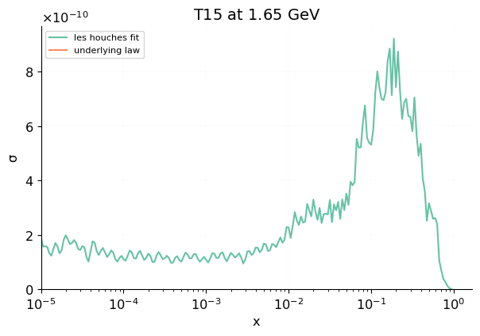
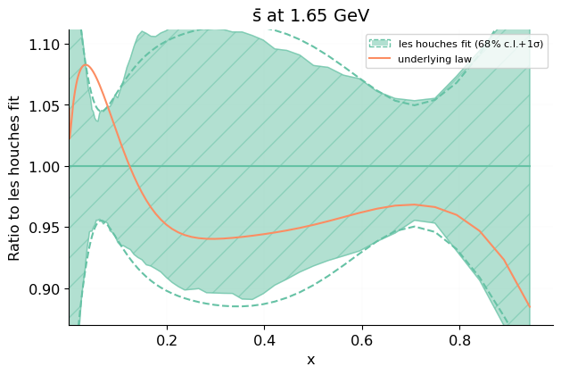
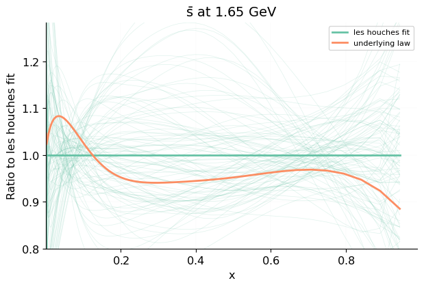
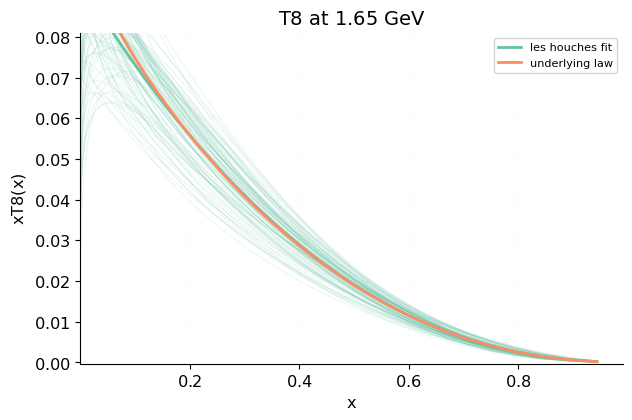

log scale
=====================

Flavour basis
-------------

Absolute

 [.pdf](figures/PDFscalespecs0_Basespecs0_PDFnormalize0_plot_pdfs_bars.pdf) [#](#PDFscalespecs0_Basespecs0_PDFnormalize0_plot_pdfs_bars)](figures/PDFscalespecs0_Basespecs0_PDFnormalize0_plot_pdfs_bars.png){#PDFscalespecs0_Basespecs0_PDFnormalize0_plot_pdfs_bars} 

 [.pdf](figures/PDFscalespecs0_Basespecs0_PDFnormalize0_plot_pdfs_baru.pdf) [#](#PDFscalespecs0_Basespecs0_PDFnormalize0_plot_pdfs_baru)](figures/PDFscalespecs0_Basespecs0_PDFnormalize0_plot_pdfs_baru.png){#PDFscalespecs0_Basespecs0_PDFnormalize0_plot_pdfs_baru} 

 [.pdf](figures/PDFscalespecs0_Basespecs0_PDFnormalize0_plot_pdfs_bard.pdf) [#](#PDFscalespecs0_Basespecs0_PDFnormalize0_plot_pdfs_bard)](figures/PDFscalespecs0_Basespecs0_PDFnormalize0_plot_pdfs_bard.png){#PDFscalespecs0_Basespecs0_PDFnormalize0_plot_pdfs_bard} 

 [.pdf](figures/PDFscalespecs0_Basespecs0_PDFnormalize0_plot_pdfs_g.pdf) [#](#PDFscalespecs0_Basespecs0_PDFnormalize0_plot_pdfs_g)](figures/PDFscalespecs0_Basespecs0_PDFnormalize0_plot_pdfs_g.png){#PDFscalespecs0_Basespecs0_PDFnormalize0_plot_pdfs_g} 

 [.pdf](figures/PDFscalespecs0_Basespecs0_PDFnormalize0_plot_pdfs_d.pdf) [#](#PDFscalespecs0_Basespecs0_PDFnormalize0_plot_pdfs_d)](figures/PDFscalespecs0_Basespecs0_PDFnormalize0_plot_pdfs_d.png){#PDFscalespecs0_Basespecs0_PDFnormalize0_plot_pdfs_d} 

 [.pdf](figures/PDFscalespecs0_Basespecs0_PDFnormalize0_plot_pdfs_u.pdf) [#](#PDFscalespecs0_Basespecs0_PDFnormalize0_plot_pdfs_u)](figures/PDFscalespecs0_Basespecs0_PDFnormalize0_plot_pdfs_u.png){#PDFscalespecs0_Basespecs0_PDFnormalize0_plot_pdfs_u} 

 [.pdf](figures/PDFscalespecs0_Basespecs0_PDFnormalize0_plot_pdfs_s.pdf) [#](#PDFscalespecs0_Basespecs0_PDFnormalize0_plot_pdfs_s)](figures/PDFscalespecs0_Basespecs0_PDFnormalize0_plot_pdfs_s.png){#PDFscalespecs0_Basespecs0_PDFnormalize0_plot_pdfs_s} 

 [.pdf](figures/PDFscalespecs0_Basespecs0_PDFnormalize0_plot_pdfs_c.pdf) [#](#PDFscalespecs0_Basespecs0_PDFnormalize0_plot_pdfs_c)](figures/PDFscalespecs0_Basespecs0_PDFnormalize0_plot_pdfs_c.png){#PDFscalespecs0_Basespecs0_PDFnormalize0_plot_pdfs_c} 

 [.pdf](figures/PDFscalespecs0_Basespecs0_PDFnormalize0_plot_pdf_uncertainties_bars.pdf) [#](#PDFscalespecs0_Basespecs0_PDFnormalize0_plot_pdf_uncertainties_bars)](figures/PDFscalespecs0_Basespecs0_PDFnormalize0_plot_pdf_uncertainties_bars.png){#PDFscalespecs0_Basespecs0_PDFnormalize0_plot_pdf_uncertainties_bars} 

 [.pdf](figures/PDFscalespecs0_Basespecs0_PDFnormalize0_plot_pdf_uncertainties_baru.pdf) [#](#PDFscalespecs0_Basespecs0_PDFnormalize0_plot_pdf_uncertainties_baru)](figures/PDFscalespecs0_Basespecs0_PDFnormalize0_plot_pdf_uncertainties_baru.png){#PDFscalespecs0_Basespecs0_PDFnormalize0_plot_pdf_uncertainties_baru} 

 [.pdf](figures/PDFscalespecs0_Basespecs0_PDFnormalize0_plot_pdf_uncertainties_bard.pdf) [#](#PDFscalespecs0_Basespecs0_PDFnormalize0_plot_pdf_uncertainties_bard)](figures/PDFscalespecs0_Basespecs0_PDFnormalize0_plot_pdf_uncertainties_bard.png){#PDFscalespecs0_Basespecs0_PDFnormalize0_plot_pdf_uncertainties_bard} 

 [.pdf](figures/PDFscalespecs0_Basespecs0_PDFnormalize0_plot_pdf_uncertainties_g.pdf) [#](#PDFscalespecs0_Basespecs0_PDFnormalize0_plot_pdf_uncertainties_g)](figures/PDFscalespecs0_Basespecs0_PDFnormalize0_plot_pdf_uncertainties_g.png){#PDFscalespecs0_Basespecs0_PDFnormalize0_plot_pdf_uncertainties_g} 

 [.pdf](figures/PDFscalespecs0_Basespecs0_PDFnormalize0_plot_pdf_uncertainties_d.pdf) [#](#PDFscalespecs0_Basespecs0_PDFnormalize0_plot_pdf_uncertainties_d)](figures/PDFscalespecs0_Basespecs0_PDFnormalize0_plot_pdf_uncertainties_d.png){#PDFscalespecs0_Basespecs0_PDFnormalize0_plot_pdf_uncertainties_d} 

 [.pdf](figures/PDFscalespecs0_Basespecs0_PDFnormalize0_plot_pdf_uncertainties_u.pdf) [#](#PDFscalespecs0_Basespecs0_PDFnormalize0_plot_pdf_uncertainties_u)](figures/PDFscalespecs0_Basespecs0_PDFnormalize0_plot_pdf_uncertainties_u.png){#PDFscalespecs0_Basespecs0_PDFnormalize0_plot_pdf_uncertainties_u} 

 [.pdf](figures/PDFscalespecs0_Basespecs0_PDFnormalize0_plot_pdf_uncertainties_s.pdf) [#](#PDFscalespecs0_Basespecs0_PDFnormalize0_plot_pdf_uncertainties_s)](figures/PDFscalespecs0_Basespecs0_PDFnormalize0_plot_pdf_uncertainties_s.png){#PDFscalespecs0_Basespecs0_PDFnormalize0_plot_pdf_uncertainties_s} 

 [.pdf](figures/PDFscalespecs0_Basespecs0_PDFnormalize0_plot_pdf_uncertainties_c.pdf) [#](#PDFscalespecs0_Basespecs0_PDFnormalize0_plot_pdf_uncertainties_c)](figures/PDFscalespecs0_Basespecs0_PDFnormalize0_plot_pdf_uncertainties_c.png){#PDFscalespecs0_Basespecs0_PDFnormalize0_plot_pdf_uncertainties_c} 

 [.pdf](figures/PDFscalespecs0_Basespecs0_PDFnormalize0_plot_pdfreplicas_bars.pdf) [#](#PDFscalespecs0_Basespecs0_PDFnormalize0_plot_pdfreplicas_bars)](figures/PDFscalespecs0_Basespecs0_PDFnormalize0_plot_pdfreplicas_bars.png){#PDFscalespecs0_Basespecs0_PDFnormalize0_plot_pdfreplicas_bars} 

 [.pdf](figures/PDFscalespecs0_Basespecs0_PDFnormalize0_plot_pdfreplicas_baru.pdf) [#](#PDFscalespecs0_Basespecs0_PDFnormalize0_plot_pdfreplicas_baru)](figures/PDFscalespecs0_Basespecs0_PDFnormalize0_plot_pdfreplicas_baru.png){#PDFscalespecs0_Basespecs0_PDFnormalize0_plot_pdfreplicas_baru} 

 [.pdf](figures/PDFscalespecs0_Basespecs0_PDFnormalize0_plot_pdfreplicas_bard.pdf) [#](#PDFscalespecs0_Basespecs0_PDFnormalize0_plot_pdfreplicas_bard)](figures/PDFscalespecs0_Basespecs0_PDFnormalize0_plot_pdfreplicas_bard.png){#PDFscalespecs0_Basespecs0_PDFnormalize0_plot_pdfreplicas_bard} 

 [.pdf](figures/PDFscalespecs0_Basespecs0_PDFnormalize0_plot_pdfreplicas_g.pdf) [#](#PDFscalespecs0_Basespecs0_PDFnormalize0_plot_pdfreplicas_g)](figures/PDFscalespecs0_Basespecs0_PDFnormalize0_plot_pdfreplicas_g.png){#PDFscalespecs0_Basespecs0_PDFnormalize0_plot_pdfreplicas_g} 

 [.pdf](figures/PDFscalespecs0_Basespecs0_PDFnormalize0_plot_pdfreplicas_d.pdf) [#](#PDFscalespecs0_Basespecs0_PDFnormalize0_plot_pdfreplicas_d)](figures/PDFscalespecs0_Basespecs0_PDFnormalize0_plot_pdfreplicas_d.png){#PDFscalespecs0_Basespecs0_PDFnormalize0_plot_pdfreplicas_d} 

 [.pdf](figures/PDFscalespecs0_Basespecs0_PDFnormalize0_plot_pdfreplicas_u.pdf) [#](#PDFscalespecs0_Basespecs0_PDFnormalize0_plot_pdfreplicas_u)](figures/PDFscalespecs0_Basespecs0_PDFnormalize0_plot_pdfreplicas_u.png){#PDFscalespecs0_Basespecs0_PDFnormalize0_plot_pdfreplicas_u} 

 [.pdf](figures/PDFscalespecs0_Basespecs0_PDFnormalize0_plot_pdfreplicas_s.pdf) [#](#PDFscalespecs0_Basespecs0_PDFnormalize0_plot_pdfreplicas_s)](figures/PDFscalespecs0_Basespecs0_PDFnormalize0_plot_pdfreplicas_s.png){#PDFscalespecs0_Basespecs0_PDFnormalize0_plot_pdfreplicas_s} 

 [.pdf](figures/PDFscalespecs0_Basespecs0_PDFnormalize0_plot_pdfreplicas_c.pdf) [#](#PDFscalespecs0_Basespecs0_PDFnormalize0_plot_pdfreplicas_c)](figures/PDFscalespecs0_Basespecs0_PDFnormalize0_plot_pdfreplicas_c.png){#PDFscalespecs0_Basespecs0_PDFnormalize0_plot_pdfreplicas_c} 

Ratio

 [.pdf](figures/PDFscalespecs0_Basespecs0_PDFnormalize1_plot_pdfs_bars.pdf) [#](#PDFscalespecs0_Basespecs0_PDFnormalize1_plot_pdfs_bars)](figures/PDFscalespecs0_Basespecs0_PDFnormalize1_plot_pdfs_bars.png){#PDFscalespecs0_Basespecs0_PDFnormalize1_plot_pdfs_bars} 

 [.pdf](figures/PDFscalespecs0_Basespecs0_PDFnormalize1_plot_pdfs_baru.pdf) [#](#PDFscalespecs0_Basespecs0_PDFnormalize1_plot_pdfs_baru)](figures/PDFscalespecs0_Basespecs0_PDFnormalize1_plot_pdfs_baru.png){#PDFscalespecs0_Basespecs0_PDFnormalize1_plot_pdfs_baru} 

 [.pdf](figures/PDFscalespecs0_Basespecs0_PDFnormalize1_plot_pdfs_bard.pdf) [#](#PDFscalespecs0_Basespecs0_PDFnormalize1_plot_pdfs_bard)](figures/PDFscalespecs0_Basespecs0_PDFnormalize1_plot_pdfs_bard.png){#PDFscalespecs0_Basespecs0_PDFnormalize1_plot_pdfs_bard} 

 [.pdf](figures/PDFscalespecs0_Basespecs0_PDFnormalize1_plot_pdfs_g.pdf) [#](#PDFscalespecs0_Basespecs0_PDFnormalize1_plot_pdfs_g)](figures/PDFscalespecs0_Basespecs0_PDFnormalize1_plot_pdfs_g.png){#PDFscalespecs0_Basespecs0_PDFnormalize1_plot_pdfs_g} 

 [.pdf](figures/PDFscalespecs0_Basespecs0_PDFnormalize1_plot_pdfs_d.pdf) [#](#PDFscalespecs0_Basespecs0_PDFnormalize1_plot_pdfs_d)](figures/PDFscalespecs0_Basespecs0_PDFnormalize1_plot_pdfs_d.png){#PDFscalespecs0_Basespecs0_PDFnormalize1_plot_pdfs_d} 

 [.pdf](figures/PDFscalespecs0_Basespecs0_PDFnormalize1_plot_pdfs_u.pdf) [#](#PDFscalespecs0_Basespecs0_PDFnormalize1_plot_pdfs_u)](figures/PDFscalespecs0_Basespecs0_PDFnormalize1_plot_pdfs_u.png){#PDFscalespecs0_Basespecs0_PDFnormalize1_plot_pdfs_u} 

 [.pdf](figures/PDFscalespecs0_Basespecs0_PDFnormalize1_plot_pdfs_s.pdf) [#](#PDFscalespecs0_Basespecs0_PDFnormalize1_plot_pdfs_s)](figures/PDFscalespecs0_Basespecs0_PDFnormalize1_plot_pdfs_s.png){#PDFscalespecs0_Basespecs0_PDFnormalize1_plot_pdfs_s} 

 [.pdf](figures/PDFscalespecs0_Basespecs0_PDFnormalize1_plot_pdfs_c.pdf) [#](#PDFscalespecs0_Basespecs0_PDFnormalize1_plot_pdfs_c)](figures/PDFscalespecs0_Basespecs0_PDFnormalize1_plot_pdfs_c.png){#PDFscalespecs0_Basespecs0_PDFnormalize1_plot_pdfs_c} 

 [.pdf](figures/PDFscalespecs0_Basespecs0_PDFnormalize1_plot_pdf_uncertainties_bars.pdf) [#](#PDFscalespecs0_Basespecs0_PDFnormalize1_plot_pdf_uncertainties_bars)](figures/PDFscalespecs0_Basespecs0_PDFnormalize1_plot_pdf_uncertainties_bars.png){#PDFscalespecs0_Basespecs0_PDFnormalize1_plot_pdf_uncertainties_bars} 

 [.pdf](figures/PDFscalespecs0_Basespecs0_PDFnormalize1_plot_pdf_uncertainties_baru.pdf) [#](#PDFscalespecs0_Basespecs0_PDFnormalize1_plot_pdf_uncertainties_baru)](figures/PDFscalespecs0_Basespecs0_PDFnormalize1_plot_pdf_uncertainties_baru.png){#PDFscalespecs0_Basespecs0_PDFnormalize1_plot_pdf_uncertainties_baru} 

 [.pdf](figures/PDFscalespecs0_Basespecs0_PDFnormalize1_plot_pdf_uncertainties_bard.pdf) [#](#PDFscalespecs0_Basespecs0_PDFnormalize1_plot_pdf_uncertainties_bard)](figures/PDFscalespecs0_Basespecs0_PDFnormalize1_plot_pdf_uncertainties_bard.png){#PDFscalespecs0_Basespecs0_PDFnormalize1_plot_pdf_uncertainties_bard} 

 [.pdf](figures/PDFscalespecs0_Basespecs0_PDFnormalize1_plot_pdf_uncertainties_g.pdf) [#](#PDFscalespecs0_Basespecs0_PDFnormalize1_plot_pdf_uncertainties_g)](figures/PDFscalespecs0_Basespecs0_PDFnormalize1_plot_pdf_uncertainties_g.png){#PDFscalespecs0_Basespecs0_PDFnormalize1_plot_pdf_uncertainties_g} 

 [.pdf](figures/PDFscalespecs0_Basespecs0_PDFnormalize1_plot_pdf_uncertainties_d.pdf) [#](#PDFscalespecs0_Basespecs0_PDFnormalize1_plot_pdf_uncertainties_d)](figures/PDFscalespecs0_Basespecs0_PDFnormalize1_plot_pdf_uncertainties_d.png){#PDFscalespecs0_Basespecs0_PDFnormalize1_plot_pdf_uncertainties_d} 

 [.pdf](figures/PDFscalespecs0_Basespecs0_PDFnormalize1_plot_pdf_uncertainties_u.pdf) [#](#PDFscalespecs0_Basespecs0_PDFnormalize1_plot_pdf_uncertainties_u)](figures/PDFscalespecs0_Basespecs0_PDFnormalize1_plot_pdf_uncertainties_u.png){#PDFscalespecs0_Basespecs0_PDFnormalize1_plot_pdf_uncertainties_u} 

 [.pdf](figures/PDFscalespecs0_Basespecs0_PDFnormalize1_plot_pdf_uncertainties_s.pdf) [#](#PDFscalespecs0_Basespecs0_PDFnormalize1_plot_pdf_uncertainties_s)](figures/PDFscalespecs0_Basespecs0_PDFnormalize1_plot_pdf_uncertainties_s.png){#PDFscalespecs0_Basespecs0_PDFnormalize1_plot_pdf_uncertainties_s} 

 [.pdf](figures/PDFscalespecs0_Basespecs0_PDFnormalize1_plot_pdf_uncertainties_c.pdf) [#](#PDFscalespecs0_Basespecs0_PDFnormalize1_plot_pdf_uncertainties_c)](figures/PDFscalespecs0_Basespecs0_PDFnormalize1_plot_pdf_uncertainties_c.png){#PDFscalespecs0_Basespecs0_PDFnormalize1_plot_pdf_uncertainties_c} 

 [.pdf](figures/PDFscalespecs0_Basespecs0_PDFnormalize1_plot_pdfreplicas_bars.pdf) [#](#PDFscalespecs0_Basespecs0_PDFnormalize1_plot_pdfreplicas_bars)](figures/PDFscalespecs0_Basespecs0_PDFnormalize1_plot_pdfreplicas_bars.png){#PDFscalespecs0_Basespecs0_PDFnormalize1_plot_pdfreplicas_bars} 

 [.pdf](figures/PDFscalespecs0_Basespecs0_PDFnormalize1_plot_pdfreplicas_baru.pdf) [#](#PDFscalespecs0_Basespecs0_PDFnormalize1_plot_pdfreplicas_baru)](figures/PDFscalespecs0_Basespecs0_PDFnormalize1_plot_pdfreplicas_baru.png){#PDFscalespecs0_Basespecs0_PDFnormalize1_plot_pdfreplicas_baru} 

 [.pdf](figures/PDFscalespecs0_Basespecs0_PDFnormalize1_plot_pdfreplicas_bard.pdf) [#](#PDFscalespecs0_Basespecs0_PDFnormalize1_plot_pdfreplicas_bard)](figures/PDFscalespecs0_Basespecs0_PDFnormalize1_plot_pdfreplicas_bard.png){#PDFscalespecs0_Basespecs0_PDFnormalize1_plot_pdfreplicas_bard} 

 [.pdf](figures/PDFscalespecs0_Basespecs0_PDFnormalize1_plot_pdfreplicas_g.pdf) [#](#PDFscalespecs0_Basespecs0_PDFnormalize1_plot_pdfreplicas_g)](figures/PDFscalespecs0_Basespecs0_PDFnormalize1_plot_pdfreplicas_g.png){#PDFscalespecs0_Basespecs0_PDFnormalize1_plot_pdfreplicas_g} 

 [.pdf](figures/PDFscalespecs0_Basespecs0_PDFnormalize1_plot_pdfreplicas_d.pdf) [#](#PDFscalespecs0_Basespecs0_PDFnormalize1_plot_pdfreplicas_d)](figures/PDFscalespecs0_Basespecs0_PDFnormalize1_plot_pdfreplicas_d.png){#PDFscalespecs0_Basespecs0_PDFnormalize1_plot_pdfreplicas_d} 

 [.pdf](figures/PDFscalespecs0_Basespecs0_PDFnormalize1_plot_pdfreplicas_u.pdf) [#](#PDFscalespecs0_Basespecs0_PDFnormalize1_plot_pdfreplicas_u)](figures/PDFscalespecs0_Basespecs0_PDFnormalize1_plot_pdfreplicas_u.png){#PDFscalespecs0_Basespecs0_PDFnormalize1_plot_pdfreplicas_u} 

 [.pdf](figures/PDFscalespecs0_Basespecs0_PDFnormalize1_plot_pdfreplicas_s.pdf) [#](#PDFscalespecs0_Basespecs0_PDFnormalize1_plot_pdfreplicas_s)](figures/PDFscalespecs0_Basespecs0_PDFnormalize1_plot_pdfreplicas_s.png){#PDFscalespecs0_Basespecs0_PDFnormalize1_plot_pdfreplicas_s} 

 [.pdf](figures/PDFscalespecs0_Basespecs0_PDFnormalize1_plot_pdfreplicas_c.pdf) [#](#PDFscalespecs0_Basespecs0_PDFnormalize1_plot_pdfreplicas_c)](figures/PDFscalespecs0_Basespecs0_PDFnormalize1_plot_pdfreplicas_c.png){#PDFscalespecs0_Basespecs0_PDFnormalize1_plot_pdfreplicas_c} 

Evolution basis
-------------

Absolute

 [.pdf](figures/PDFscalespecs0_Basespecs1_PDFnormalize0_plot_pdfs_Sigma.pdf) [#](#PDFscalespecs0_Basespecs1_PDFnormalize0_plot_pdfs_Sigma)](figures/PDFscalespecs0_Basespecs1_PDFnormalize0_plot_pdfs_Sigma.png){#PDFscalespecs0_Basespecs1_PDFnormalize0_plot_pdfs_Sigma} 

 [.pdf](figures/PDFscalespecs0_Basespecs1_PDFnormalize0_plot_pdfs_V.pdf) [#](#PDFscalespecs0_Basespecs1_PDFnormalize0_plot_pdfs_V)](figures/PDFscalespecs0_Basespecs1_PDFnormalize0_plot_pdfs_V.png){#PDFscalespecs0_Basespecs1_PDFnormalize0_plot_pdfs_V} 

 [.pdf](figures/PDFscalespecs0_Basespecs1_PDFnormalize0_plot_pdfs_T3.pdf) [#](#PDFscalespecs0_Basespecs1_PDFnormalize0_plot_pdfs_T3)](figures/PDFscalespecs0_Basespecs1_PDFnormalize0_plot_pdfs_T3.png){#PDFscalespecs0_Basespecs1_PDFnormalize0_plot_pdfs_T3} 

 [.pdf](figures/PDFscalespecs0_Basespecs1_PDFnormalize0_plot_pdfs_V3.pdf) [#](#PDFscalespecs0_Basespecs1_PDFnormalize0_plot_pdfs_V3)](figures/PDFscalespecs0_Basespecs1_PDFnormalize0_plot_pdfs_V3.png){#PDFscalespecs0_Basespecs1_PDFnormalize0_plot_pdfs_V3} 

 [.pdf](figures/PDFscalespecs0_Basespecs1_PDFnormalize0_plot_pdfs_T8.pdf) [#](#PDFscalespecs0_Basespecs1_PDFnormalize0_plot_pdfs_T8)](figures/PDFscalespecs0_Basespecs1_PDFnormalize0_plot_pdfs_T8.png){#PDFscalespecs0_Basespecs1_PDFnormalize0_plot_pdfs_T8} 

 [.pdf](figures/PDFscalespecs0_Basespecs1_PDFnormalize0_plot_pdfs_V8.pdf) [#](#PDFscalespecs0_Basespecs1_PDFnormalize0_plot_pdfs_V8)](figures/PDFscalespecs0_Basespecs1_PDFnormalize0_plot_pdfs_V8.png){#PDFscalespecs0_Basespecs1_PDFnormalize0_plot_pdfs_V8} 

 [.pdf](figures/PDFscalespecs0_Basespecs1_PDFnormalize0_plot_pdfs_T15.pdf) [#](#PDFscalespecs0_Basespecs1_PDFnormalize0_plot_pdfs_T15)](figures/PDFscalespecs0_Basespecs1_PDFnormalize0_plot_pdfs_T15.png){#PDFscalespecs0_Basespecs1_PDFnormalize0_plot_pdfs_T15} 

 [.pdf](figures/PDFscalespecs0_Basespecs1_PDFnormalize0_plot_pdfs_g.pdf) [#](#PDFscalespecs0_Basespecs1_PDFnormalize0_plot_pdfs_g)](figures/PDFscalespecs0_Basespecs1_PDFnormalize0_plot_pdfs_g.png){#PDFscalespecs0_Basespecs1_PDFnormalize0_plot_pdfs_g} 

 [.pdf](figures/PDFscalespecs0_Basespecs1_PDFnormalize0_plot_pdf_uncertainties_Sigma.pdf) [#](#PDFscalespecs0_Basespecs1_PDFnormalize0_plot_pdf_uncertainties_Sigma)](figures/PDFscalespecs0_Basespecs1_PDFnormalize0_plot_pdf_uncertainties_Sigma.png){#PDFscalespecs0_Basespecs1_PDFnormalize0_plot_pdf_uncertainties_Sigma} 

 [.pdf](figures/PDFscalespecs0_Basespecs1_PDFnormalize0_plot_pdf_uncertainties_V.pdf) [#](#PDFscalespecs0_Basespecs1_PDFnormalize0_plot_pdf_uncertainties_V)](figures/PDFscalespecs0_Basespecs1_PDFnormalize0_plot_pdf_uncertainties_V.png){#PDFscalespecs0_Basespecs1_PDFnormalize0_plot_pdf_uncertainties_V} 

 [.pdf](figures/PDFscalespecs0_Basespecs1_PDFnormalize0_plot_pdf_uncertainties_T3.pdf) [#](#PDFscalespecs0_Basespecs1_PDFnormalize0_plot_pdf_uncertainties_T3)](figures/PDFscalespecs0_Basespecs1_PDFnormalize0_plot_pdf_uncertainties_T3.png){#PDFscalespecs0_Basespecs1_PDFnormalize0_plot_pdf_uncertainties_T3} 

 [.pdf](figures/PDFscalespecs0_Basespecs1_PDFnormalize0_plot_pdf_uncertainties_V3.pdf) [#](#PDFscalespecs0_Basespecs1_PDFnormalize0_plot_pdf_uncertainties_V3)](figures/PDFscalespecs0_Basespecs1_PDFnormalize0_plot_pdf_uncertainties_V3.png){#PDFscalespecs0_Basespecs1_PDFnormalize0_plot_pdf_uncertainties_V3} 

 [.pdf](figures/PDFscalespecs0_Basespecs1_PDFnormalize0_plot_pdf_uncertainties_T8.pdf) [#](#PDFscalespecs0_Basespecs1_PDFnormalize0_plot_pdf_uncertainties_T8)](figures/PDFscalespecs0_Basespecs1_PDFnormalize0_plot_pdf_uncertainties_T8.png){#PDFscalespecs0_Basespecs1_PDFnormalize0_plot_pdf_uncertainties_T8} 

 [.pdf](figures/PDFscalespecs0_Basespecs1_PDFnormalize0_plot_pdf_uncertainties_V8.pdf) [#](#PDFscalespecs0_Basespecs1_PDFnormalize0_plot_pdf_uncertainties_V8)](figures/PDFscalespecs0_Basespecs1_PDFnormalize0_plot_pdf_uncertainties_V8.png){#PDFscalespecs0_Basespecs1_PDFnormalize0_plot_pdf_uncertainties_V8} 

 [.pdf](figures/PDFscalespecs0_Basespecs1_PDFnormalize0_plot_pdf_uncertainties_T15.pdf) [#](#PDFscalespecs0_Basespecs1_PDFnormalize0_plot_pdf_uncertainties_T15)](figures/PDFscalespecs0_Basespecs1_PDFnormalize0_plot_pdf_uncertainties_T15.png){#PDFscalespecs0_Basespecs1_PDFnormalize0_plot_pdf_uncertainties_T15} 

 [.pdf](figures/PDFscalespecs0_Basespecs1_PDFnormalize0_plot_pdf_uncertainties_g.pdf) [#](#PDFscalespecs0_Basespecs1_PDFnormalize0_plot_pdf_uncertainties_g)](figures/PDFscalespecs0_Basespecs1_PDFnormalize0_plot_pdf_uncertainties_g.png){#PDFscalespecs0_Basespecs1_PDFnormalize0_plot_pdf_uncertainties_g} 

 [.pdf](figures/PDFscalespecs0_Basespecs1_PDFnormalize0_plot_pdfreplicas_Sigma.pdf) [#](#PDFscalespecs0_Basespecs1_PDFnormalize0_plot_pdfreplicas_Sigma)](figures/PDFscalespecs0_Basespecs1_PDFnormalize0_plot_pdfreplicas_Sigma.png){#PDFscalespecs0_Basespecs1_PDFnormalize0_plot_pdfreplicas_Sigma} 

 [.pdf](figures/PDFscalespecs0_Basespecs1_PDFnormalize0_plot_pdfreplicas_V.pdf) [#](#PDFscalespecs0_Basespecs1_PDFnormalize0_plot_pdfreplicas_V)](figures/PDFscalespecs0_Basespecs1_PDFnormalize0_plot_pdfreplicas_V.png){#PDFscalespecs0_Basespecs1_PDFnormalize0_plot_pdfreplicas_V} 

 [.pdf](figures/PDFscalespecs0_Basespecs1_PDFnormalize0_plot_pdfreplicas_T3.pdf) [#](#PDFscalespecs0_Basespecs1_PDFnormalize0_plot_pdfreplicas_T3)](figures/PDFscalespecs0_Basespecs1_PDFnormalize0_plot_pdfreplicas_T3.png){#PDFscalespecs0_Basespecs1_PDFnormalize0_plot_pdfreplicas_T3} 

 [.pdf](figures/PDFscalespecs0_Basespecs1_PDFnormalize0_plot_pdfreplicas_V3.pdf) [#](#PDFscalespecs0_Basespecs1_PDFnormalize0_plot_pdfreplicas_V3)](figures/PDFscalespecs0_Basespecs1_PDFnormalize0_plot_pdfreplicas_V3.png){#PDFscalespecs0_Basespecs1_PDFnormalize0_plot_pdfreplicas_V3} 

 [.pdf](figures/PDFscalespecs0_Basespecs1_PDFnormalize0_plot_pdfreplicas_T8.pdf) [#](#PDFscalespecs0_Basespecs1_PDFnormalize0_plot_pdfreplicas_T8)](figures/PDFscalespecs0_Basespecs1_PDFnormalize0_plot_pdfreplicas_T8.png){#PDFscalespecs0_Basespecs1_PDFnormalize0_plot_pdfreplicas_T8} 

 [.pdf](figures/PDFscalespecs0_Basespecs1_PDFnormalize0_plot_pdfreplicas_V8.pdf) [#](#PDFscalespecs0_Basespecs1_PDFnormalize0_plot_pdfreplicas_V8)](figures/PDFscalespecs0_Basespecs1_PDFnormalize0_plot_pdfreplicas_V8.png){#PDFscalespecs0_Basespecs1_PDFnormalize0_plot_pdfreplicas_V8} 

 [.pdf](figures/PDFscalespecs0_Basespecs1_PDFnormalize0_plot_pdfreplicas_T15.pdf) [#](#PDFscalespecs0_Basespecs1_PDFnormalize0_plot_pdfreplicas_T15)](figures/PDFscalespecs0_Basespecs1_PDFnormalize0_plot_pdfreplicas_T15.png){#PDFscalespecs0_Basespecs1_PDFnormalize0_plot_pdfreplicas_T15} 

 [.pdf](figures/PDFscalespecs0_Basespecs1_PDFnormalize0_plot_pdfreplicas_g.pdf) [#](#PDFscalespecs0_Basespecs1_PDFnormalize0_plot_pdfreplicas_g)](figures/PDFscalespecs0_Basespecs1_PDFnormalize0_plot_pdfreplicas_g.png){#PDFscalespecs0_Basespecs1_PDFnormalize0_plot_pdfreplicas_g} 

Ratio

 [.pdf](figures/PDFscalespecs0_Basespecs1_PDFnormalize1_plot_pdfs_Sigma.pdf) [#](#PDFscalespecs0_Basespecs1_PDFnormalize1_plot_pdfs_Sigma)](figures/PDFscalespecs0_Basespecs1_PDFnormalize1_plot_pdfs_Sigma.png){#PDFscalespecs0_Basespecs1_PDFnormalize1_plot_pdfs_Sigma} 

 [.pdf](figures/PDFscalespecs0_Basespecs1_PDFnormalize1_plot_pdfs_V.pdf) [#](#PDFscalespecs0_Basespecs1_PDFnormalize1_plot_pdfs_V)](figures/PDFscalespecs0_Basespecs1_PDFnormalize1_plot_pdfs_V.png){#PDFscalespecs0_Basespecs1_PDFnormalize1_plot_pdfs_V} 

 [.pdf](figures/PDFscalespecs0_Basespecs1_PDFnormalize1_plot_pdfs_T3.pdf) [#](#PDFscalespecs0_Basespecs1_PDFnormalize1_plot_pdfs_T3)](figures/PDFscalespecs0_Basespecs1_PDFnormalize1_plot_pdfs_T3.png){#PDFscalespecs0_Basespecs1_PDFnormalize1_plot_pdfs_T3} 

 [.pdf](figures/PDFscalespecs0_Basespecs1_PDFnormalize1_plot_pdfs_V3.pdf) [#](#PDFscalespecs0_Basespecs1_PDFnormalize1_plot_pdfs_V3)](figures/PDFscalespecs0_Basespecs1_PDFnormalize1_plot_pdfs_V3.png){#PDFscalespecs0_Basespecs1_PDFnormalize1_plot_pdfs_V3} 

 [.pdf](figures/PDFscalespecs0_Basespecs1_PDFnormalize1_plot_pdfs_T8.pdf) [#](#PDFscalespecs0_Basespecs1_PDFnormalize1_plot_pdfs_T8)](figures/PDFscalespecs0_Basespecs1_PDFnormalize1_plot_pdfs_T8.png){#PDFscalespecs0_Basespecs1_PDFnormalize1_plot_pdfs_T8} 

 [.pdf](figures/PDFscalespecs0_Basespecs1_PDFnormalize1_plot_pdfs_V8.pdf) [#](#PDFscalespecs0_Basespecs1_PDFnormalize1_plot_pdfs_V8)](figures/PDFscalespecs0_Basespecs1_PDFnormalize1_plot_pdfs_V8.png){#PDFscalespecs0_Basespecs1_PDFnormalize1_plot_pdfs_V8} 

 [.pdf](figures/PDFscalespecs0_Basespecs1_PDFnormalize1_plot_pdfs_T15.pdf) [#](#PDFscalespecs0_Basespecs1_PDFnormalize1_plot_pdfs_T15)](figures/PDFscalespecs0_Basespecs1_PDFnormalize1_plot_pdfs_T15.png){#PDFscalespecs0_Basespecs1_PDFnormalize1_plot_pdfs_T15} 

 [.pdf](figures/PDFscalespecs0_Basespecs1_PDFnormalize1_plot_pdfs_g.pdf) [#](#PDFscalespecs0_Basespecs1_PDFnormalize1_plot_pdfs_g)](figures/PDFscalespecs0_Basespecs1_PDFnormalize1_plot_pdfs_g.png){#PDFscalespecs0_Basespecs1_PDFnormalize1_plot_pdfs_g} 

 [.pdf](figures/PDFscalespecs0_Basespecs1_PDFnormalize1_plot_pdf_uncertainties_Sigma.pdf) [#](#PDFscalespecs0_Basespecs1_PDFnormalize1_plot_pdf_uncertainties_Sigma)](figures/PDFscalespecs0_Basespecs1_PDFnormalize1_plot_pdf_uncertainties_Sigma.png){#PDFscalespecs0_Basespecs1_PDFnormalize1_plot_pdf_uncertainties_Sigma} 

 [.pdf](figures/PDFscalespecs0_Basespecs1_PDFnormalize1_plot_pdf_uncertainties_V.pdf) [#](#PDFscalespecs0_Basespecs1_PDFnormalize1_plot_pdf_uncertainties_V)](figures/PDFscalespecs0_Basespecs1_PDFnormalize1_plot_pdf_uncertainties_V.png){#PDFscalespecs0_Basespecs1_PDFnormalize1_plot_pdf_uncertainties_V} 

 [.pdf](figures/PDFscalespecs0_Basespecs1_PDFnormalize1_plot_pdf_uncertainties_T3.pdf) [#](#PDFscalespecs0_Basespecs1_PDFnormalize1_plot_pdf_uncertainties_T3)](figures/PDFscalespecs0_Basespecs1_PDFnormalize1_plot_pdf_uncertainties_T3.png){#PDFscalespecs0_Basespecs1_PDFnormalize1_plot_pdf_uncertainties_T3} 

 [.pdf](figures/PDFscalespecs0_Basespecs1_PDFnormalize1_plot_pdf_uncertainties_V3.pdf) [#](#PDFscalespecs0_Basespecs1_PDFnormalize1_plot_pdf_uncertainties_V3)](figures/PDFscalespecs0_Basespecs1_PDFnormalize1_plot_pdf_uncertainties_V3.png){#PDFscalespecs0_Basespecs1_PDFnormalize1_plot_pdf_uncertainties_V3} 

 [.pdf](figures/PDFscalespecs0_Basespecs1_PDFnormalize1_plot_pdf_uncertainties_T8.pdf) [#](#PDFscalespecs0_Basespecs1_PDFnormalize1_plot_pdf_uncertainties_T8)](figures/PDFscalespecs0_Basespecs1_PDFnormalize1_plot_pdf_uncertainties_T8.png){#PDFscalespecs0_Basespecs1_PDFnormalize1_plot_pdf_uncertainties_T8} 

 [.pdf](figures/PDFscalespecs0_Basespecs1_PDFnormalize1_plot_pdf_uncertainties_V8.pdf) [#](#PDFscalespecs0_Basespecs1_PDFnormalize1_plot_pdf_uncertainties_V8)](figures/PDFscalespecs0_Basespecs1_PDFnormalize1_plot_pdf_uncertainties_V8.png){#PDFscalespecs0_Basespecs1_PDFnormalize1_plot_pdf_uncertainties_V8} 

 [.pdf](figures/PDFscalespecs0_Basespecs1_PDFnormalize1_plot_pdf_uncertainties_T15.pdf) [#](#PDFscalespecs0_Basespecs1_PDFnormalize1_plot_pdf_uncertainties_T15)](figures/PDFscalespecs0_Basespecs1_PDFnormalize1_plot_pdf_uncertainties_T15.png){#PDFscalespecs0_Basespecs1_PDFnormalize1_plot_pdf_uncertainties_T15} 

 [.pdf](figures/PDFscalespecs0_Basespecs1_PDFnormalize1_plot_pdf_uncertainties_g.pdf) [#](#PDFscalespecs0_Basespecs1_PDFnormalize1_plot_pdf_uncertainties_g)](figures/PDFscalespecs0_Basespecs1_PDFnormalize1_plot_pdf_uncertainties_g.png){#PDFscalespecs0_Basespecs1_PDFnormalize1_plot_pdf_uncertainties_g} 

 [.pdf](figures/PDFscalespecs0_Basespecs1_PDFnormalize1_plot_pdfreplicas_Sigma.pdf) [#](#PDFscalespecs0_Basespecs1_PDFnormalize1_plot_pdfreplicas_Sigma)](figures/PDFscalespecs0_Basespecs1_PDFnormalize1_plot_pdfreplicas_Sigma.png){#PDFscalespecs0_Basespecs1_PDFnormalize1_plot_pdfreplicas_Sigma} 

 [.pdf](figures/PDFscalespecs0_Basespecs1_PDFnormalize1_plot_pdfreplicas_V.pdf) [#](#PDFscalespecs0_Basespecs1_PDFnormalize1_plot_pdfreplicas_V)](figures/PDFscalespecs0_Basespecs1_PDFnormalize1_plot_pdfreplicas_V.png){#PDFscalespecs0_Basespecs1_PDFnormalize1_plot_pdfreplicas_V} 

 [.pdf](figures/PDFscalespecs0_Basespecs1_PDFnormalize1_plot_pdfreplicas_T3.pdf) [#](#PDFscalespecs0_Basespecs1_PDFnormalize1_plot_pdfreplicas_T3)](figures/PDFscalespecs0_Basespecs1_PDFnormalize1_plot_pdfreplicas_T3.png){#PDFscalespecs0_Basespecs1_PDFnormalize1_plot_pdfreplicas_T3} 

 [.pdf](figures/PDFscalespecs0_Basespecs1_PDFnormalize1_plot_pdfreplicas_V3.pdf) [#](#PDFscalespecs0_Basespecs1_PDFnormalize1_plot_pdfreplicas_V3)](figures/PDFscalespecs0_Basespecs1_PDFnormalize1_plot_pdfreplicas_V3.png){#PDFscalespecs0_Basespecs1_PDFnormalize1_plot_pdfreplicas_V3} 

 [.pdf](figures/PDFscalespecs0_Basespecs1_PDFnormalize1_plot_pdfreplicas_T8.pdf) [#](#PDFscalespecs0_Basespecs1_PDFnormalize1_plot_pdfreplicas_T8)](figures/PDFscalespecs0_Basespecs1_PDFnormalize1_plot_pdfreplicas_T8.png){#PDFscalespecs0_Basespecs1_PDFnormalize1_plot_pdfreplicas_T8} 

 [.pdf](figures/PDFscalespecs0_Basespecs1_PDFnormalize1_plot_pdfreplicas_V8.pdf) [#](#PDFscalespecs0_Basespecs1_PDFnormalize1_plot_pdfreplicas_V8)](figures/PDFscalespecs0_Basespecs1_PDFnormalize1_plot_pdfreplicas_V8.png){#PDFscalespecs0_Basespecs1_PDFnormalize1_plot_pdfreplicas_V8} 

 [.pdf](figures/PDFscalespecs0_Basespecs1_PDFnormalize1_plot_pdfreplicas_T15.pdf) [#](#PDFscalespecs0_Basespecs1_PDFnormalize1_plot_pdfreplicas_T15)](figures/PDFscalespecs0_Basespecs1_PDFnormalize1_plot_pdfreplicas_T15.png){#PDFscalespecs0_Basespecs1_PDFnormalize1_plot_pdfreplicas_T15} 

 [.pdf](figures/PDFscalespecs0_Basespecs1_PDFnormalize1_plot_pdfreplicas_g.pdf) [#](#PDFscalespecs0_Basespecs1_PDFnormalize1_plot_pdfreplicas_g)](figures/PDFscalespecs0_Basespecs1_PDFnormalize1_plot_pdfreplicas_g.png){#PDFscalespecs0_Basespecs1_PDFnormalize1_plot_pdfreplicas_g} 

Linear scale
=====================

Flavour basis
-------------

Absolute

 [.pdf](figures/PDFscalespecs1_Basespecs0_PDFnormalize0_plot_pdfs_bars.pdf) [#](#PDFscalespecs1_Basespecs0_PDFnormalize0_plot_pdfs_bars)](figures/PDFscalespecs1_Basespecs0_PDFnormalize0_plot_pdfs_bars.png){#PDFscalespecs1_Basespecs0_PDFnormalize0_plot_pdfs_bars} 

 [.pdf](figures/PDFscalespecs1_Basespecs0_PDFnormalize0_plot_pdfs_baru.pdf) [#](#PDFscalespecs1_Basespecs0_PDFnormalize0_plot_pdfs_baru)](figures/PDFscalespecs1_Basespecs0_PDFnormalize0_plot_pdfs_baru.png){#PDFscalespecs1_Basespecs0_PDFnormalize0_plot_pdfs_baru} 

 [.pdf](figures/PDFscalespecs1_Basespecs0_PDFnormalize0_plot_pdfs_bard.pdf) [#](#PDFscalespecs1_Basespecs0_PDFnormalize0_plot_pdfs_bard)](figures/PDFscalespecs1_Basespecs0_PDFnormalize0_plot_pdfs_bard.png){#PDFscalespecs1_Basespecs0_PDFnormalize0_plot_pdfs_bard} 

 [.pdf](figures/PDFscalespecs1_Basespecs0_PDFnormalize0_plot_pdfs_g.pdf) [#](#PDFscalespecs1_Basespecs0_PDFnormalize0_plot_pdfs_g)](figures/PDFscalespecs1_Basespecs0_PDFnormalize0_plot_pdfs_g.png){#PDFscalespecs1_Basespecs0_PDFnormalize0_plot_pdfs_g} 

 [.pdf](figures/PDFscalespecs1_Basespecs0_PDFnormalize0_plot_pdfs_d.pdf) [#](#PDFscalespecs1_Basespecs0_PDFnormalize0_plot_pdfs_d)](figures/PDFscalespecs1_Basespecs0_PDFnormalize0_plot_pdfs_d.png){#PDFscalespecs1_Basespecs0_PDFnormalize0_plot_pdfs_d} 

 [.pdf](figures/PDFscalespecs1_Basespecs0_PDFnormalize0_plot_pdfs_u.pdf) [#](#PDFscalespecs1_Basespecs0_PDFnormalize0_plot_pdfs_u)](figures/PDFscalespecs1_Basespecs0_PDFnormalize0_plot_pdfs_u.png){#PDFscalespecs1_Basespecs0_PDFnormalize0_plot_pdfs_u} 

 [.pdf](figures/PDFscalespecs1_Basespecs0_PDFnormalize0_plot_pdfs_s.pdf) [#](#PDFscalespecs1_Basespecs0_PDFnormalize0_plot_pdfs_s)](figures/PDFscalespecs1_Basespecs0_PDFnormalize0_plot_pdfs_s.png){#PDFscalespecs1_Basespecs0_PDFnormalize0_plot_pdfs_s} 

 [.pdf](figures/PDFscalespecs1_Basespecs0_PDFnormalize0_plot_pdfs_c.pdf) [#](#PDFscalespecs1_Basespecs0_PDFnormalize0_plot_pdfs_c)](figures/PDFscalespecs1_Basespecs0_PDFnormalize0_plot_pdfs_c.png){#PDFscalespecs1_Basespecs0_PDFnormalize0_plot_pdfs_c} 

 [.pdf](figures/PDFscalespecs1_Basespecs0_PDFnormalize0_plot_pdf_uncertainties_bars.pdf) [#](#PDFscalespecs1_Basespecs0_PDFnormalize0_plot_pdf_uncertainties_bars)](figures/PDFscalespecs1_Basespecs0_PDFnormalize0_plot_pdf_uncertainties_bars.png){#PDFscalespecs1_Basespecs0_PDFnormalize0_plot_pdf_uncertainties_bars} 

 [.pdf](figures/PDFscalespecs1_Basespecs0_PDFnormalize0_plot_pdf_uncertainties_baru.pdf) [#](#PDFscalespecs1_Basespecs0_PDFnormalize0_plot_pdf_uncertainties_baru)](figures/PDFscalespecs1_Basespecs0_PDFnormalize0_plot_pdf_uncertainties_baru.png){#PDFscalespecs1_Basespecs0_PDFnormalize0_plot_pdf_uncertainties_baru} 

 [.pdf](figures/PDFscalespecs1_Basespecs0_PDFnormalize0_plot_pdf_uncertainties_bard.pdf) [#](#PDFscalespecs1_Basespecs0_PDFnormalize0_plot_pdf_uncertainties_bard)](figures/PDFscalespecs1_Basespecs0_PDFnormalize0_plot_pdf_uncertainties_bard.png){#PDFscalespecs1_Basespecs0_PDFnormalize0_plot_pdf_uncertainties_bard} 

 [.pdf](figures/PDFscalespecs1_Basespecs0_PDFnormalize0_plot_pdf_uncertainties_g.pdf) [#](#PDFscalespecs1_Basespecs0_PDFnormalize0_plot_pdf_uncertainties_g)](figures/PDFscalespecs1_Basespecs0_PDFnormalize0_plot_pdf_uncertainties_g.png){#PDFscalespecs1_Basespecs0_PDFnormalize0_plot_pdf_uncertainties_g} 

 [.pdf](figures/PDFscalespecs1_Basespecs0_PDFnormalize0_plot_pdf_uncertainties_d.pdf) [#](#PDFscalespecs1_Basespecs0_PDFnormalize0_plot_pdf_uncertainties_d)](figures/PDFscalespecs1_Basespecs0_PDFnormalize0_plot_pdf_uncertainties_d.png){#PDFscalespecs1_Basespecs0_PDFnormalize0_plot_pdf_uncertainties_d} 

 [.pdf](figures/PDFscalespecs1_Basespecs0_PDFnormalize0_plot_pdf_uncertainties_u.pdf) [#](#PDFscalespecs1_Basespecs0_PDFnormalize0_plot_pdf_uncertainties_u)](figures/PDFscalespecs1_Basespecs0_PDFnormalize0_plot_pdf_uncertainties_u.png){#PDFscalespecs1_Basespecs0_PDFnormalize0_plot_pdf_uncertainties_u} 

 [.pdf](figures/PDFscalespecs1_Basespecs0_PDFnormalize0_plot_pdf_uncertainties_s.pdf) [#](#PDFscalespecs1_Basespecs0_PDFnormalize0_plot_pdf_uncertainties_s)](figures/PDFscalespecs1_Basespecs0_PDFnormalize0_plot_pdf_uncertainties_s.png){#PDFscalespecs1_Basespecs0_PDFnormalize0_plot_pdf_uncertainties_s} 

 [.pdf](figures/PDFscalespecs1_Basespecs0_PDFnormalize0_plot_pdf_uncertainties_c.pdf) [#](#PDFscalespecs1_Basespecs0_PDFnormalize0_plot_pdf_uncertainties_c)](figures/PDFscalespecs1_Basespecs0_PDFnormalize0_plot_pdf_uncertainties_c.png){#PDFscalespecs1_Basespecs0_PDFnormalize0_plot_pdf_uncertainties_c} 

 [.pdf](figures/PDFscalespecs1_Basespecs0_PDFnormalize0_plot_pdfreplicas_bars.pdf) [#](#PDFscalespecs1_Basespecs0_PDFnormalize0_plot_pdfreplicas_bars)](figures/PDFscalespecs1_Basespecs0_PDFnormalize0_plot_pdfreplicas_bars.png){#PDFscalespecs1_Basespecs0_PDFnormalize0_plot_pdfreplicas_bars} 

 [.pdf](figures/PDFscalespecs1_Basespecs0_PDFnormalize0_plot_pdfreplicas_baru.pdf) [#](#PDFscalespecs1_Basespecs0_PDFnormalize0_plot_pdfreplicas_baru)](figures/PDFscalespecs1_Basespecs0_PDFnormalize0_plot_pdfreplicas_baru.png){#PDFscalespecs1_Basespecs0_PDFnormalize0_plot_pdfreplicas_baru} 

 [.pdf](figures/PDFscalespecs1_Basespecs0_PDFnormalize0_plot_pdfreplicas_bard.pdf) [#](#PDFscalespecs1_Basespecs0_PDFnormalize0_plot_pdfreplicas_bard)](figures/PDFscalespecs1_Basespecs0_PDFnormalize0_plot_pdfreplicas_bard.png){#PDFscalespecs1_Basespecs0_PDFnormalize0_plot_pdfreplicas_bard} 

 [.pdf](figures/PDFscalespecs1_Basespecs0_PDFnormalize0_plot_pdfreplicas_g.pdf) [#](#PDFscalespecs1_Basespecs0_PDFnormalize0_plot_pdfreplicas_g)](figures/PDFscalespecs1_Basespecs0_PDFnormalize0_plot_pdfreplicas_g.png){#PDFscalespecs1_Basespecs0_PDFnormalize0_plot_pdfreplicas_g} 

 [.pdf](figures/PDFscalespecs1_Basespecs0_PDFnormalize0_plot_pdfreplicas_d.pdf) [#](#PDFscalespecs1_Basespecs0_PDFnormalize0_plot_pdfreplicas_d)](figures/PDFscalespecs1_Basespecs0_PDFnormalize0_plot_pdfreplicas_d.png){#PDFscalespecs1_Basespecs0_PDFnormalize0_plot_pdfreplicas_d} 

 [.pdf](figures/PDFscalespecs1_Basespecs0_PDFnormalize0_plot_pdfreplicas_u.pdf) [#](#PDFscalespecs1_Basespecs0_PDFnormalize0_plot_pdfreplicas_u)](figures/PDFscalespecs1_Basespecs0_PDFnormalize0_plot_pdfreplicas_u.png){#PDFscalespecs1_Basespecs0_PDFnormalize0_plot_pdfreplicas_u} 

 [.pdf](figures/PDFscalespecs1_Basespecs0_PDFnormalize0_plot_pdfreplicas_s.pdf) [#](#PDFscalespecs1_Basespecs0_PDFnormalize0_plot_pdfreplicas_s)](figures/PDFscalespecs1_Basespecs0_PDFnormalize0_plot_pdfreplicas_s.png){#PDFscalespecs1_Basespecs0_PDFnormalize0_plot_pdfreplicas_s} 

 [.pdf](figures/PDFscalespecs1_Basespecs0_PDFnormalize0_plot_pdfreplicas_c.pdf) [#](#PDFscalespecs1_Basespecs0_PDFnormalize0_plot_pdfreplicas_c)](figures/PDFscalespecs1_Basespecs0_PDFnormalize0_plot_pdfreplicas_c.png){#PDFscalespecs1_Basespecs0_PDFnormalize0_plot_pdfreplicas_c} 

Ratio

 [.pdf](figures/PDFscalespecs1_Basespecs0_PDFnormalize1_plot_pdfs_bars.pdf) [#](#PDFscalespecs1_Basespecs0_PDFnormalize1_plot_pdfs_bars)](figures/PDFscalespecs1_Basespecs0_PDFnormalize1_plot_pdfs_bars.png){#PDFscalespecs1_Basespecs0_PDFnormalize1_plot_pdfs_bars} 

 [.pdf](figures/PDFscalespecs1_Basespecs0_PDFnormalize1_plot_pdfs_baru.pdf) [#](#PDFscalespecs1_Basespecs0_PDFnormalize1_plot_pdfs_baru)](figures/PDFscalespecs1_Basespecs0_PDFnormalize1_plot_pdfs_baru.png){#PDFscalespecs1_Basespecs0_PDFnormalize1_plot_pdfs_baru} 

 [.pdf](figures/PDFscalespecs1_Basespecs0_PDFnormalize1_plot_pdfs_bard.pdf) [#](#PDFscalespecs1_Basespecs0_PDFnormalize1_plot_pdfs_bard)](figures/PDFscalespecs1_Basespecs0_PDFnormalize1_plot_pdfs_bard.png){#PDFscalespecs1_Basespecs0_PDFnormalize1_plot_pdfs_bard} 

 [.pdf](figures/PDFscalespecs1_Basespecs0_PDFnormalize1_plot_pdfs_g.pdf) [#](#PDFscalespecs1_Basespecs0_PDFnormalize1_plot_pdfs_g)](figures/PDFscalespecs1_Basespecs0_PDFnormalize1_plot_pdfs_g.png){#PDFscalespecs1_Basespecs0_PDFnormalize1_plot_pdfs_g} 

 [.pdf](figures/PDFscalespecs1_Basespecs0_PDFnormalize1_plot_pdfs_d.pdf) [#](#PDFscalespecs1_Basespecs0_PDFnormalize1_plot_pdfs_d)](figures/PDFscalespecs1_Basespecs0_PDFnormalize1_plot_pdfs_d.png){#PDFscalespecs1_Basespecs0_PDFnormalize1_plot_pdfs_d} 

 [.pdf](figures/PDFscalespecs1_Basespecs0_PDFnormalize1_plot_pdfs_u.pdf) [#](#PDFscalespecs1_Basespecs0_PDFnormalize1_plot_pdfs_u)](figures/PDFscalespecs1_Basespecs0_PDFnormalize1_plot_pdfs_u.png){#PDFscalespecs1_Basespecs0_PDFnormalize1_plot_pdfs_u} 

 [.pdf](figures/PDFscalespecs1_Basespecs0_PDFnormalize1_plot_pdfs_s.pdf) [#](#PDFscalespecs1_Basespecs0_PDFnormalize1_plot_pdfs_s)](figures/PDFscalespecs1_Basespecs0_PDFnormalize1_plot_pdfs_s.png){#PDFscalespecs1_Basespecs0_PDFnormalize1_plot_pdfs_s} 

 [.pdf](figures/PDFscalespecs1_Basespecs0_PDFnormalize1_plot_pdfs_c.pdf) [#](#PDFscalespecs1_Basespecs0_PDFnormalize1_plot_pdfs_c)](figures/PDFscalespecs1_Basespecs0_PDFnormalize1_plot_pdfs_c.png){#PDFscalespecs1_Basespecs0_PDFnormalize1_plot_pdfs_c} 

 [.pdf](figures/PDFscalespecs1_Basespecs0_PDFnormalize1_plot_pdf_uncertainties_bars.pdf) [#](#PDFscalespecs1_Basespecs0_PDFnormalize1_plot_pdf_uncertainties_bars)](figures/PDFscalespecs1_Basespecs0_PDFnormalize1_plot_pdf_uncertainties_bars.png){#PDFscalespecs1_Basespecs0_PDFnormalize1_plot_pdf_uncertainties_bars} 

 [.pdf](figures/PDFscalespecs1_Basespecs0_PDFnormalize1_plot_pdf_uncertainties_baru.pdf) [#](#PDFscalespecs1_Basespecs0_PDFnormalize1_plot_pdf_uncertainties_baru)](figures/PDFscalespecs1_Basespecs0_PDFnormalize1_plot_pdf_uncertainties_baru.png){#PDFscalespecs1_Basespecs0_PDFnormalize1_plot_pdf_uncertainties_baru} 

 [.pdf](figures/PDFscalespecs1_Basespecs0_PDFnormalize1_plot_pdf_uncertainties_bard.pdf) [#](#PDFscalespecs1_Basespecs0_PDFnormalize1_plot_pdf_uncertainties_bard)](figures/PDFscalespecs1_Basespecs0_PDFnormalize1_plot_pdf_uncertainties_bard.png){#PDFscalespecs1_Basespecs0_PDFnormalize1_plot_pdf_uncertainties_bard} 

 [.pdf](figures/PDFscalespecs1_Basespecs0_PDFnormalize1_plot_pdf_uncertainties_g.pdf) [#](#PDFscalespecs1_Basespecs0_PDFnormalize1_plot_pdf_uncertainties_g)](figures/PDFscalespecs1_Basespecs0_PDFnormalize1_plot_pdf_uncertainties_g.png){#PDFscalespecs1_Basespecs0_PDFnormalize1_plot_pdf_uncertainties_g} 

 [.pdf](figures/PDFscalespecs1_Basespecs0_PDFnormalize1_plot_pdf_uncertainties_d.pdf) [#](#PDFscalespecs1_Basespecs0_PDFnormalize1_plot_pdf_uncertainties_d)](figures/PDFscalespecs1_Basespecs0_PDFnormalize1_plot_pdf_uncertainties_d.png){#PDFscalespecs1_Basespecs0_PDFnormalize1_plot_pdf_uncertainties_d} 

 [.pdf](figures/PDFscalespecs1_Basespecs0_PDFnormalize1_plot_pdf_uncertainties_u.pdf) [#](#PDFscalespecs1_Basespecs0_PDFnormalize1_plot_pdf_uncertainties_u)](figures/PDFscalespecs1_Basespecs0_PDFnormalize1_plot_pdf_uncertainties_u.png){#PDFscalespecs1_Basespecs0_PDFnormalize1_plot_pdf_uncertainties_u} 

 [.pdf](figures/PDFscalespecs1_Basespecs0_PDFnormalize1_plot_pdf_uncertainties_s.pdf) [#](#PDFscalespecs1_Basespecs0_PDFnormalize1_plot_pdf_uncertainties_s)](figures/PDFscalespecs1_Basespecs0_PDFnormalize1_plot_pdf_uncertainties_s.png){#PDFscalespecs1_Basespecs0_PDFnormalize1_plot_pdf_uncertainties_s} 

 [.pdf](figures/PDFscalespecs1_Basespecs0_PDFnormalize1_plot_pdf_uncertainties_c.pdf) [#](#PDFscalespecs1_Basespecs0_PDFnormalize1_plot_pdf_uncertainties_c)](figures/PDFscalespecs1_Basespecs0_PDFnormalize1_plot_pdf_uncertainties_c.png){#PDFscalespecs1_Basespecs0_PDFnormalize1_plot_pdf_uncertainties_c} 

 [.pdf](figures/PDFscalespecs1_Basespecs0_PDFnormalize1_plot_pdfreplicas_bars.pdf) [#](#PDFscalespecs1_Basespecs0_PDFnormalize1_plot_pdfreplicas_bars)](figures/PDFscalespecs1_Basespecs0_PDFnormalize1_plot_pdfreplicas_bars.png){#PDFscalespecs1_Basespecs0_PDFnormalize1_plot_pdfreplicas_bars} 

 [.pdf](figures/PDFscalespecs1_Basespecs0_PDFnormalize1_plot_pdfreplicas_baru.pdf) [#](#PDFscalespecs1_Basespecs0_PDFnormalize1_plot_pdfreplicas_baru)](figures/PDFscalespecs1_Basespecs0_PDFnormalize1_plot_pdfreplicas_baru.png){#PDFscalespecs1_Basespecs0_PDFnormalize1_plot_pdfreplicas_baru} 

 [.pdf](figures/PDFscalespecs1_Basespecs0_PDFnormalize1_plot_pdfreplicas_bard.pdf) [#](#PDFscalespecs1_Basespecs0_PDFnormalize1_plot_pdfreplicas_bard)](figures/PDFscalespecs1_Basespecs0_PDFnormalize1_plot_pdfreplicas_bard.png){#PDFscalespecs1_Basespecs0_PDFnormalize1_plot_pdfreplicas_bard} 

 [.pdf](figures/PDFscalespecs1_Basespecs0_PDFnormalize1_plot_pdfreplicas_g.pdf) [#](#PDFscalespecs1_Basespecs0_PDFnormalize1_plot_pdfreplicas_g)](figures/PDFscalespecs1_Basespecs0_PDFnormalize1_plot_pdfreplicas_g.png){#PDFscalespecs1_Basespecs0_PDFnormalize1_plot_pdfreplicas_g} 

 [.pdf](figures/PDFscalespecs1_Basespecs0_PDFnormalize1_plot_pdfreplicas_d.pdf) [#](#PDFscalespecs1_Basespecs0_PDFnormalize1_plot_pdfreplicas_d)](figures/PDFscalespecs1_Basespecs0_PDFnormalize1_plot_pdfreplicas_d.png){#PDFscalespecs1_Basespecs0_PDFnormalize1_plot_pdfreplicas_d} 

 [.pdf](figures/PDFscalespecs1_Basespecs0_PDFnormalize1_plot_pdfreplicas_u.pdf) [#](#PDFscalespecs1_Basespecs0_PDFnormalize1_plot_pdfreplicas_u)](figures/PDFscalespecs1_Basespecs0_PDFnormalize1_plot_pdfreplicas_u.png){#PDFscalespecs1_Basespecs0_PDFnormalize1_plot_pdfreplicas_u} 

 [.pdf](figures/PDFscalespecs1_Basespecs0_PDFnormalize1_plot_pdfreplicas_s.pdf) [#](#PDFscalespecs1_Basespecs0_PDFnormalize1_plot_pdfreplicas_s)](figures/PDFscalespecs1_Basespecs0_PDFnormalize1_plot_pdfreplicas_s.png){#PDFscalespecs1_Basespecs0_PDFnormalize1_plot_pdfreplicas_s} 

 [.pdf](figures/PDFscalespecs1_Basespecs0_PDFnormalize1_plot_pdfreplicas_c.pdf) [#](#PDFscalespecs1_Basespecs0_PDFnormalize1_plot_pdfreplicas_c)](figures/PDFscalespecs1_Basespecs0_PDFnormalize1_plot_pdfreplicas_c.png){#PDFscalespecs1_Basespecs0_PDFnormalize1_plot_pdfreplicas_c} 

Evolution basis
-------------

Absolute

 [.pdf](figures/PDFscalespecs1_Basespecs1_PDFnormalize0_plot_pdfs_Sigma.pdf) [#](#PDFscalespecs1_Basespecs1_PDFnormalize0_plot_pdfs_Sigma)](figures/PDFscalespecs1_Basespecs1_PDFnormalize0_plot_pdfs_Sigma.png){#PDFscalespecs1_Basespecs1_PDFnormalize0_plot_pdfs_Sigma} 

 [.pdf](figures/PDFscalespecs1_Basespecs1_PDFnormalize0_plot_pdfs_V.pdf) [#](#PDFscalespecs1_Basespecs1_PDFnormalize0_plot_pdfs_V)](figures/PDFscalespecs1_Basespecs1_PDFnormalize0_plot_pdfs_V.png){#PDFscalespecs1_Basespecs1_PDFnormalize0_plot_pdfs_V} 

 [.pdf](figures/PDFscalespecs1_Basespecs1_PDFnormalize0_plot_pdfs_T3.pdf) [#](#PDFscalespecs1_Basespecs1_PDFnormalize0_plot_pdfs_T3)](figures/PDFscalespecs1_Basespecs1_PDFnormalize0_plot_pdfs_T3.png){#PDFscalespecs1_Basespecs1_PDFnormalize0_plot_pdfs_T3} 

 [.pdf](figures/PDFscalespecs1_Basespecs1_PDFnormalize0_plot_pdfs_V3.pdf) [#](#PDFscalespecs1_Basespecs1_PDFnormalize0_plot_pdfs_V3)](figures/PDFscalespecs1_Basespecs1_PDFnormalize0_plot_pdfs_V3.png){#PDFscalespecs1_Basespecs1_PDFnormalize0_plot_pdfs_V3} 

 [.pdf](figures/PDFscalespecs1_Basespecs1_PDFnormalize0_plot_pdfs_T8.pdf) [#](#PDFscalespecs1_Basespecs1_PDFnormalize0_plot_pdfs_T8)](figures/PDFscalespecs1_Basespecs1_PDFnormalize0_plot_pdfs_T8.png){#PDFscalespecs1_Basespecs1_PDFnormalize0_plot_pdfs_T8} 

 [.pdf](figures/PDFscalespecs1_Basespecs1_PDFnormalize0_plot_pdfs_V8.pdf) [#](#PDFscalespecs1_Basespecs1_PDFnormalize0_plot_pdfs_V8)](figures/PDFscalespecs1_Basespecs1_PDFnormalize0_plot_pdfs_V8.png){#PDFscalespecs1_Basespecs1_PDFnormalize0_plot_pdfs_V8} 

 [.pdf](figures/PDFscalespecs1_Basespecs1_PDFnormalize0_plot_pdfs_T15.pdf) [#](#PDFscalespecs1_Basespecs1_PDFnormalize0_plot_pdfs_T15)](figures/PDFscalespecs1_Basespecs1_PDFnormalize0_plot_pdfs_T15.png){#PDFscalespecs1_Basespecs1_PDFnormalize0_plot_pdfs_T15} 

 [.pdf](figures/PDFscalespecs1_Basespecs1_PDFnormalize0_plot_pdfs_g.pdf) [#](#PDFscalespecs1_Basespecs1_PDFnormalize0_plot_pdfs_g)](figures/PDFscalespecs1_Basespecs1_PDFnormalize0_plot_pdfs_g.png){#PDFscalespecs1_Basespecs1_PDFnormalize0_plot_pdfs_g} 

 [.pdf](figures/PDFscalespecs1_Basespecs1_PDFnormalize0_plot_pdf_uncertainties_Sigma.pdf) [#](#PDFscalespecs1_Basespecs1_PDFnormalize0_plot_pdf_uncertainties_Sigma)](figures/PDFscalespecs1_Basespecs1_PDFnormalize0_plot_pdf_uncertainties_Sigma.png){#PDFscalespecs1_Basespecs1_PDFnormalize0_plot_pdf_uncertainties_Sigma} 

 [.pdf](figures/PDFscalespecs1_Basespecs1_PDFnormalize0_plot_pdf_uncertainties_V.pdf) [#](#PDFscalespecs1_Basespecs1_PDFnormalize0_plot_pdf_uncertainties_V)](figures/PDFscalespecs1_Basespecs1_PDFnormalize0_plot_pdf_uncertainties_V.png){#PDFscalespecs1_Basespecs1_PDFnormalize0_plot_pdf_uncertainties_V} 

 [.pdf](figures/PDFscalespecs1_Basespecs1_PDFnormalize0_plot_pdf_uncertainties_T3.pdf) [#](#PDFscalespecs1_Basespecs1_PDFnormalize0_plot_pdf_uncertainties_T3)](figures/PDFscalespecs1_Basespecs1_PDFnormalize0_plot_pdf_uncertainties_T3.png){#PDFscalespecs1_Basespecs1_PDFnormalize0_plot_pdf_uncertainties_T3} 

 [.pdf](figures/PDFscalespecs1_Basespecs1_PDFnormalize0_plot_pdf_uncertainties_V3.pdf) [#](#PDFscalespecs1_Basespecs1_PDFnormalize0_plot_pdf_uncertainties_V3)](figures/PDFscalespecs1_Basespecs1_PDFnormalize0_plot_pdf_uncertainties_V3.png){#PDFscalespecs1_Basespecs1_PDFnormalize0_plot_pdf_uncertainties_V3} 

 [.pdf](figures/PDFscalespecs1_Basespecs1_PDFnormalize0_plot_pdf_uncertainties_T8.pdf) [#](#PDFscalespecs1_Basespecs1_PDFnormalize0_plot_pdf_uncertainties_T8)](figures/PDFscalespecs1_Basespecs1_PDFnormalize0_plot_pdf_uncertainties_T8.png){#PDFscalespecs1_Basespecs1_PDFnormalize0_plot_pdf_uncertainties_T8} 

 [.pdf](figures/PDFscalespecs1_Basespecs1_PDFnormalize0_plot_pdf_uncertainties_V8.pdf) [#](#PDFscalespecs1_Basespecs1_PDFnormalize0_plot_pdf_uncertainties_V8)](figures/PDFscalespecs1_Basespecs1_PDFnormalize0_plot_pdf_uncertainties_V8.png){#PDFscalespecs1_Basespecs1_PDFnormalize0_plot_pdf_uncertainties_V8} 

 [.pdf](figures/PDFscalespecs1_Basespecs1_PDFnormalize0_plot_pdf_uncertainties_T15.pdf) [#](#PDFscalespecs1_Basespecs1_PDFnormalize0_plot_pdf_uncertainties_T15)](figures/PDFscalespecs1_Basespecs1_PDFnormalize0_plot_pdf_uncertainties_T15.png){#PDFscalespecs1_Basespecs1_PDFnormalize0_plot_pdf_uncertainties_T15} 

 [.pdf](figures/PDFscalespecs1_Basespecs1_PDFnormalize0_plot_pdf_uncertainties_g.pdf) [#](#PDFscalespecs1_Basespecs1_PDFnormalize0_plot_pdf_uncertainties_g)](figures/PDFscalespecs1_Basespecs1_PDFnormalize0_plot_pdf_uncertainties_g.png){#PDFscalespecs1_Basespecs1_PDFnormalize0_plot_pdf_uncertainties_g} 

 [.pdf](figures/PDFscalespecs1_Basespecs1_PDFnormalize0_plot_pdfreplicas_Sigma.pdf) [#](#PDFscalespecs1_Basespecs1_PDFnormalize0_plot_pdfreplicas_Sigma)](figures/PDFscalespecs1_Basespecs1_PDFnormalize0_plot_pdfreplicas_Sigma.png){#PDFscalespecs1_Basespecs1_PDFnormalize0_plot_pdfreplicas_Sigma} 

 [.pdf](figures/PDFscalespecs1_Basespecs1_PDFnormalize0_plot_pdfreplicas_V.pdf) [#](#PDFscalespecs1_Basespecs1_PDFnormalize0_plot_pdfreplicas_V)](figures/PDFscalespecs1_Basespecs1_PDFnormalize0_plot_pdfreplicas_V.png){#PDFscalespecs1_Basespecs1_PDFnormalize0_plot_pdfreplicas_V} 

 [.pdf](figures/PDFscalespecs1_Basespecs1_PDFnormalize0_plot_pdfreplicas_T3.pdf) [#](#PDFscalespecs1_Basespecs1_PDFnormalize0_plot_pdfreplicas_T3)](figures/PDFscalespecs1_Basespecs1_PDFnormalize0_plot_pdfreplicas_T3.png){#PDFscalespecs1_Basespecs1_PDFnormalize0_plot_pdfreplicas_T3} 

 [.pdf](figures/PDFscalespecs1_Basespecs1_PDFnormalize0_plot_pdfreplicas_V3.pdf) [#](#PDFscalespecs1_Basespecs1_PDFnormalize0_plot_pdfreplicas_V3)](figures/PDFscalespecs1_Basespecs1_PDFnormalize0_plot_pdfreplicas_V3.png){#PDFscalespecs1_Basespecs1_PDFnormalize0_plot_pdfreplicas_V3} 

 [.pdf](figures/PDFscalespecs1_Basespecs1_PDFnormalize0_plot_pdfreplicas_T8.pdf) [#](#PDFscalespecs1_Basespecs1_PDFnormalize0_plot_pdfreplicas_T8)](figures/PDFscalespecs1_Basespecs1_PDFnormalize0_plot_pdfreplicas_T8.png){#PDFscalespecs1_Basespecs1_PDFnormalize0_plot_pdfreplicas_T8} 

 [.pdf](figures/PDFscalespecs1_Basespecs1_PDFnormalize0_plot_pdfreplicas_V8.pdf) [#](#PDFscalespecs1_Basespecs1_PDFnormalize0_plot_pdfreplicas_V8)](figures/PDFscalespecs1_Basespecs1_PDFnormalize0_plot_pdfreplicas_V8.png){#PDFscalespecs1_Basespecs1_PDFnormalize0_plot_pdfreplicas_V8} 

 [.pdf](figures/PDFscalespecs1_Basespecs1_PDFnormalize0_plot_pdfreplicas_T15.pdf) [#](#PDFscalespecs1_Basespecs1_PDFnormalize0_plot_pdfreplicas_T15)](figures/PDFscalespecs1_Basespecs1_PDFnormalize0_plot_pdfreplicas_T15.png){#PDFscalespecs1_Basespecs1_PDFnormalize0_plot_pdfreplicas_T15} 

 [.pdf](figures/PDFscalespecs1_Basespecs1_PDFnormalize0_plot_pdfreplicas_g.pdf) [#](#PDFscalespecs1_Basespecs1_PDFnormalize0_plot_pdfreplicas_g)](figures/PDFscalespecs1_Basespecs1_PDFnormalize0_plot_pdfreplicas_g.png){#PDFscalespecs1_Basespecs1_PDFnormalize0_plot_pdfreplicas_g} 

Ratio

 [.pdf](figures/PDFscalespecs1_Basespecs1_PDFnormalize1_plot_pdfs_Sigma.pdf) [#](#PDFscalespecs1_Basespecs1_PDFnormalize1_plot_pdfs_Sigma)](figures/PDFscalespecs1_Basespecs1_PDFnormalize1_plot_pdfs_Sigma.png){#PDFscalespecs1_Basespecs1_PDFnormalize1_plot_pdfs_Sigma} 

 [.pdf](figures/PDFscalespecs1_Basespecs1_PDFnormalize1_plot_pdfs_V.pdf) [#](#PDFscalespecs1_Basespecs1_PDFnormalize1_plot_pdfs_V)](figures/PDFscalespecs1_Basespecs1_PDFnormalize1_plot_pdfs_V.png){#PDFscalespecs1_Basespecs1_PDFnormalize1_plot_pdfs_V} 

 [.pdf](figures/PDFscalespecs1_Basespecs1_PDFnormalize1_plot_pdfs_T3.pdf) [#](#PDFscalespecs1_Basespecs1_PDFnormalize1_plot_pdfs_T3)](figures/PDFscalespecs1_Basespecs1_PDFnormalize1_plot_pdfs_T3.png){#PDFscalespecs1_Basespecs1_PDFnormalize1_plot_pdfs_T3} 

 [.pdf](figures/PDFscalespecs1_Basespecs1_PDFnormalize1_plot_pdfs_V3.pdf) [#](#PDFscalespecs1_Basespecs1_PDFnormalize1_plot_pdfs_V3)](figures/PDFscalespecs1_Basespecs1_PDFnormalize1_plot_pdfs_V3.png){#PDFscalespecs1_Basespecs1_PDFnormalize1_plot_pdfs_V3} 

 [.pdf](figures/PDFscalespecs1_Basespecs1_PDFnormalize1_plot_pdfs_T8.pdf) [#](#PDFscalespecs1_Basespecs1_PDFnormalize1_plot_pdfs_T8)](figures/PDFscalespecs1_Basespecs1_PDFnormalize1_plot_pdfs_T8.png){#PDFscalespecs1_Basespecs1_PDFnormalize1_plot_pdfs_T8} 

 [.pdf](figures/PDFscalespecs1_Basespecs1_PDFnormalize1_plot_pdfs_V8.pdf) [#](#PDFscalespecs1_Basespecs1_PDFnormalize1_plot_pdfs_V8)](figures/PDFscalespecs1_Basespecs1_PDFnormalize1_plot_pdfs_V8.png){#PDFscalespecs1_Basespecs1_PDFnormalize1_plot_pdfs_V8} 

 [.pdf](figures/PDFscalespecs1_Basespecs1_PDFnormalize1_plot_pdfs_T15.pdf) [#](#PDFscalespecs1_Basespecs1_PDFnormalize1_plot_pdfs_T15)](figures/PDFscalespecs1_Basespecs1_PDFnormalize1_plot_pdfs_T15.png){#PDFscalespecs1_Basespecs1_PDFnormalize1_plot_pdfs_T15} 

 [.pdf](figures/PDFscalespecs1_Basespecs1_PDFnormalize1_plot_pdfs_g.pdf) [#](#PDFscalespecs1_Basespecs1_PDFnormalize1_plot_pdfs_g)](figures/PDFscalespecs1_Basespecs1_PDFnormalize1_plot_pdfs_g.png){#PDFscalespecs1_Basespecs1_PDFnormalize1_plot_pdfs_g} 

 [.pdf](figures/PDFscalespecs1_Basespecs1_PDFnormalize1_plot_pdf_uncertainties_Sigma.pdf) [#](#PDFscalespecs1_Basespecs1_PDFnormalize1_plot_pdf_uncertainties_Sigma)](figures/PDFscalespecs1_Basespecs1_PDFnormalize1_plot_pdf_uncertainties_Sigma.png){#PDFscalespecs1_Basespecs1_PDFnormalize1_plot_pdf_uncertainties_Sigma} 

 [.pdf](figures/PDFscalespecs1_Basespecs1_PDFnormalize1_plot_pdf_uncertainties_V.pdf) [#](#PDFscalespecs1_Basespecs1_PDFnormalize1_plot_pdf_uncertainties_V)](figures/PDFscalespecs1_Basespecs1_PDFnormalize1_plot_pdf_uncertainties_V.png){#PDFscalespecs1_Basespecs1_PDFnormalize1_plot_pdf_uncertainties_V} 

 [.pdf](figures/PDFscalespecs1_Basespecs1_PDFnormalize1_plot_pdf_uncertainties_T3.pdf) [#](#PDFscalespecs1_Basespecs1_PDFnormalize1_plot_pdf_uncertainties_T3)](figures/PDFscalespecs1_Basespecs1_PDFnormalize1_plot_pdf_uncertainties_T3.png){#PDFscalespecs1_Basespecs1_PDFnormalize1_plot_pdf_uncertainties_T3} 

 [.pdf](figures/PDFscalespecs1_Basespecs1_PDFnormalize1_plot_pdf_uncertainties_V3.pdf) [#](#PDFscalespecs1_Basespecs1_PDFnormalize1_plot_pdf_uncertainties_V3)](figures/PDFscalespecs1_Basespecs1_PDFnormalize1_plot_pdf_uncertainties_V3.png){#PDFscalespecs1_Basespecs1_PDFnormalize1_plot_pdf_uncertainties_V3} 

 [.pdf](figures/PDFscalespecs1_Basespecs1_PDFnormalize1_plot_pdf_uncertainties_T8.pdf) [#](#PDFscalespecs1_Basespecs1_PDFnormalize1_plot_pdf_uncertainties_T8)](figures/PDFscalespecs1_Basespecs1_PDFnormalize1_plot_pdf_uncertainties_T8.png){#PDFscalespecs1_Basespecs1_PDFnormalize1_plot_pdf_uncertainties_T8} 

 [.pdf](figures/PDFscalespecs1_Basespecs1_PDFnormalize1_plot_pdf_uncertainties_V8.pdf) [#](#PDFscalespecs1_Basespecs1_PDFnormalize1_plot_pdf_uncertainties_V8)](figures/PDFscalespecs1_Basespecs1_PDFnormalize1_plot_pdf_uncertainties_V8.png){#PDFscalespecs1_Basespecs1_PDFnormalize1_plot_pdf_uncertainties_V8} 

 [.pdf](figures/PDFscalespecs1_Basespecs1_PDFnormalize1_plot_pdf_uncertainties_T15.pdf) [#](#PDFscalespecs1_Basespecs1_PDFnormalize1_plot_pdf_uncertainties_T15)](figures/PDFscalespecs1_Basespecs1_PDFnormalize1_plot_pdf_uncertainties_T15.png){#PDFscalespecs1_Basespecs1_PDFnormalize1_plot_pdf_uncertainties_T15} 

 [.pdf](figures/PDFscalespecs1_Basespecs1_PDFnormalize1_plot_pdf_uncertainties_g.pdf) [#](#PDFscalespecs1_Basespecs1_PDFnormalize1_plot_pdf_uncertainties_g)](figures/PDFscalespecs1_Basespecs1_PDFnormalize1_plot_pdf_uncertainties_g.png){#PDFscalespecs1_Basespecs1_PDFnormalize1_plot_pdf_uncertainties_g} 

 [.pdf](figures/PDFscalespecs1_Basespecs1_PDFnormalize1_plot_pdfreplicas_Sigma.pdf) [#](#PDFscalespecs1_Basespecs1_PDFnormalize1_plot_pdfreplicas_Sigma)](figures/PDFscalespecs1_Basespecs1_PDFnormalize1_plot_pdfreplicas_Sigma.png){#PDFscalespecs1_Basespecs1_PDFnormalize1_plot_pdfreplicas_Sigma} 

 [.pdf](figures/PDFscalespecs1_Basespecs1_PDFnormalize1_plot_pdfreplicas_V.pdf) [#](#PDFscalespecs1_Basespecs1_PDFnormalize1_plot_pdfreplicas_V)](figures/PDFscalespecs1_Basespecs1_PDFnormalize1_plot_pdfreplicas_V.png){#PDFscalespecs1_Basespecs1_PDFnormalize1_plot_pdfreplicas_V} 

 [.pdf](figures/PDFscalespecs1_Basespecs1_PDFnormalize1_plot_pdfreplicas_T3.pdf) [#](#PDFscalespecs1_Basespecs1_PDFnormalize1_plot_pdfreplicas_T3)](figures/PDFscalespecs1_Basespecs1_PDFnormalize1_plot_pdfreplicas_T3.png){#PDFscalespecs1_Basespecs1_PDFnormalize1_plot_pdfreplicas_T3} 

 [.pdf](figures/PDFscalespecs1_Basespecs1_PDFnormalize1_plot_pdfreplicas_V3.pdf) [#](#PDFscalespecs1_Basespecs1_PDFnormalize1_plot_pdfreplicas_V3)](figures/PDFscalespecs1_Basespecs1_PDFnormalize1_plot_pdfreplicas_V3.png){#PDFscalespecs1_Basespecs1_PDFnormalize1_plot_pdfreplicas_V3} 

 [.pdf](figures/PDFscalespecs1_Basespecs1_PDFnormalize1_plot_pdfreplicas_T8.pdf) [#](#PDFscalespecs1_Basespecs1_PDFnormalize1_plot_pdfreplicas_T8)](figures/PDFscalespecs1_Basespecs1_PDFnormalize1_plot_pdfreplicas_T8.png){#PDFscalespecs1_Basespecs1_PDFnormalize1_plot_pdfreplicas_T8} 

 [.pdf](figures/PDFscalespecs1_Basespecs1_PDFnormalize1_plot_pdfreplicas_V8.pdf) [#](#PDFscalespecs1_Basespecs1_PDFnormalize1_plot_pdfreplicas_V8)](figures/PDFscalespecs1_Basespecs1_PDFnormalize1_plot_pdfreplicas_V8.png){#PDFscalespecs1_Basespecs1_PDFnormalize1_plot_pdfreplicas_V8} 

 [.pdf](figures/PDFscalespecs1_Basespecs1_PDFnormalize1_plot_pdfreplicas_T15.pdf) [#](#PDFscalespecs1_Basespecs1_PDFnormalize1_plot_pdfreplicas_T15)](figures/PDFscalespecs1_Basespecs1_PDFnormalize1_plot_pdfreplicas_T15.png){#PDFscalespecs1_Basespecs1_PDFnormalize1_plot_pdfreplicas_T15} 

 [.pdf](figures/PDFscalespecs1_Basespecs1_PDFnormalize1_plot_pdfreplicas_g.pdf) [#](#PDFscalespecs1_Basespecs1_PDFnormalize1_plot_pdfreplicas_g)](figures/PDFscalespecs1_Basespecs1_PDFnormalize1_plot_pdfreplicas_g.png){#PDFscalespecs1_Basespecs1_PDFnormalize1_plot_pdfreplicas_g} 

